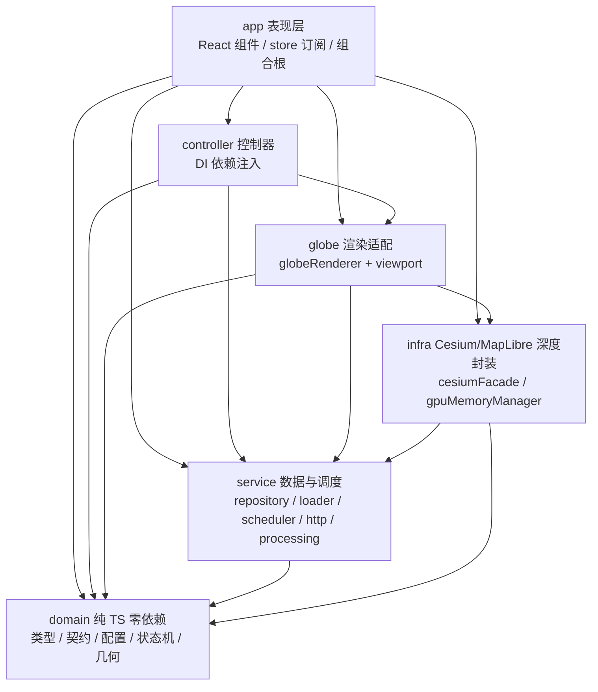
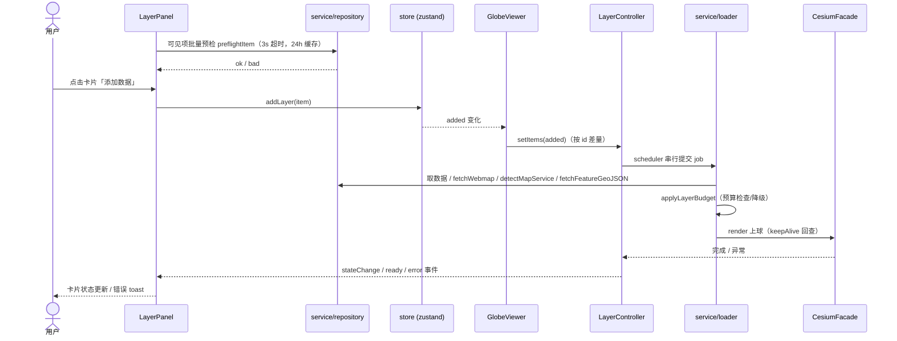
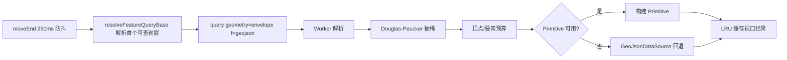
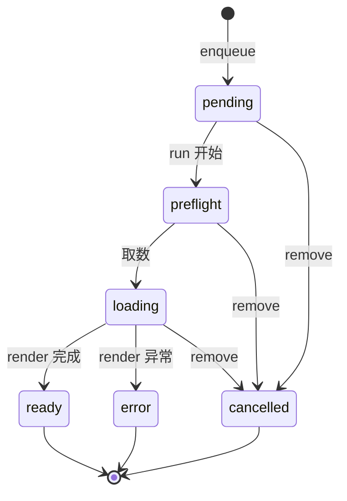

# CLAUDE.md — Earth Viewer · Agent 上手手册

> 本文件是 **Agent（Claude Code / Codex 等）接手本项目的工程与运行参考**：读完「0. 30 秒速览」就能正确操作，需要细节时按章节/任务索引查。视觉实现约束以根目录 `DESIGN.md` 为准。
> 改代码前请先通读本文件 + 相关源码；**带 ★ 的是"绝不可回退"的规则**，改动前务必三思。

---

## 0. 30 秒速览

- **项目**：画廊式 3D 地球图层应用。Cesium 渲染地球 + 接入 ArcGIS Online 公开图层（搜索 → 卡片添加按钮校验 → 叠加），线上 https://earth.gis2all.top
- **代码**：`D:\Code\earth-viz-hub`；git remote = `github.com/gis2all/earth-viewer`
- **技术栈**：React 18 · CesiumJS 1.144（★精确锁定）· Vite 5 · TypeScript 5.6 · zustand；Node ≥ 22；Vitest + Playwright；Docker；Cloudflare Pages

| 命令 | 用途 |
|---|---|
| `npm run dev` | 本地开发 http://127.0.0.1:5173（★strictPort，被占先停进程，见 §3.1） |
| `npm run test:coverage` | 单测 + 覆盖率门禁（★statements/lines ≥ 90%） |
| `npm run lint` / `npm run build` | ESLint / 生产构建（dist/） |
| `npm run check:arch` | 层间依赖矩阵扫描 + lint（★Cesium/MapLibre 引用收敛） |
| `npm run test:e2e` | Playwright E2E（含真实 ArcGIS 集成） |
| `docker compose up --build` | Docker 运行（5173） |
| `npx wrangler pages deploy --project-name=earth-viewer` | 部署到 Cloudflare Pages（需 token，见 §13） |

**★ 不可违反规则**（详见对应章节）：
1. 开发端口固定 5173（strictPort），被占必须先停占用进程，禁止 5174/5175（§3.1、§17）
2. 未经用户明确准许，不得 `git add / commit / push`（§14 T5、§17）
3. CesiumJS 锁 1.144.0，勿改回 `^`（§2）
4. 架构依赖方向由 `check:arch` 强制：层间导入走全依赖矩阵（app→controller/globe/infra/service→domain），Cesium/MapLibre 仅 `src/infra/**`（§4.1）
5. 生产 CSP 的 `script-src` 必须含 `blob:`（否则球空白）；CSP 唯一来源 `public/_headers`（§13）
6. UI 视觉约束以根目录 `DESIGN.md` 为准；改 UI 前先与用户讨论（§1.1）
7. 不使用子 agent（§17）

**常见任务索引**：新增图层类型 → §14 T1 · 加效果开关 → §14 T2 · 跑全套验证 → §14 T3 · 部署 Pages → §14 T4 · 提交代码 → §14 T5 · 排查球空白 → §14 T6 · GPU 内存降级排查 → §14 T7

---

## 1. 项目定位

**Earth Viewer**：画廊式 3D 地球图层应用，目标是可以上线、不是 demo。左侧「图层」面板搜索 ArcGIS Online Web Map/Web Scene，点击卡片添加按钮校验并按类型叠加到 Cesium 球上；右侧「效果」面板调节环境/地形/视图；顶栏提供回正/复位/主题切换、GitHub 导航和应用内沉浸模式。深浅色双主题，全直角 UI。

### 1.1 UI 规范

根目录 [`DESIGN.md`](DESIGN.md) 是现有界面的视觉与交互实现约束（唯一来源），覆盖双主题令牌、布局尺寸、图层卡片、面板控件、滚动条、状态行为、无障碍要求和禁止回退项。任何 UI 改动前必须先阅读该文件；当代码与文档不一致时，应先确认哪一方代表最新已确认设计，再同步另一方。

---

## 2. 技术栈与依赖

| 依赖 | 版本说明 |
|---|---|
| React | 18.3.x |
| CesiumJS | **1.144.0**（★精确锁定，勿改回 `^`） |
| Vite | 5.4.x（`vite-plugin-cesium`，生产注入经典 Cesium.js） |
| TypeScript | 5.6.x（strict） |
| zustand | 4.5.x（全局状态 + persist localStorage `earth-viewer`） |
| proj4 / @mapbox/vector-tile / pbf | ArcGIS 数据转换：坐标重投影 / MVT 矢量瓦片解码 |
| maplibre-gl | 6.6.x：矢量瓦片官方样式（root.json）离屏渲染 → 自定义 ImageryProvider 喂给 Cesium |
| Vitest / Testing Library | 单测 + 覆盖率（v8 provider） |
| Playwright | E2E |
| Node.js | **≥ 22**（CI/Docker 统一 + `engines` 与 .npmrc `engine-strict` 本地强制） |
| Docker | 两阶段镜像（node:22-alpine），Compose 运行 |
| Cloudflare Pages + wrangler | 生产部署 |

- 渲染引擎是 **Cesium**；矢量瓦片样式渲染用 **MapLibre GL**（离屏栅格化后经自定义 ImageryProvider 贴到 Cesium 球上，见 §6.5）；无时间轴（已删除）。
- Cesium 深度封装只在 `src/infra/cesiumFacade.ts`；MapLibre 只在 `src/infra/arcgisVectorTileImageryProvider.ts`（§4.1 强制收敛）。

---

## 3. 运行方式

### 3.1 本地开发

```text
npm install
npm run dev        # http://127.0.0.1:5173
```

vite 内置 `/sharing` 代理（转发 `www.arcgis.com`，绕 CORS）。★开发端口固定 5173：5173 被占时不得接受 Vite 自动递增到 5174/5175，必须先定位并停止占用进程，再启动。具体命令见 §17。

### 3.2 生产构建 + Node 代理（自托管）

> ★构建注意：maplibre 的 worker 通过 `new URL(..., import.meta.url)` 动态加载，vite 无法静态解析。
> 已用 `import ... from 'maplibre-gl/dist/maplibre-gl-worker.mjs?worker&url'` + vite.config.ts 的 `worker.format='es'`
> 把它打包成**自包含 ESM worker**（否则生产构建只复制单文件、缺 maplibre-gl-shared.mjs 依赖 → 样式永不 load）。

```text
npm run build               # dist/
node server/proxy.mjs 5173  # 静态托管 dist + /sharing 代理（默认 5173）
```

### 3.3 Docker

```text
docker compose up --build   # http://127.0.0.1:5173
docker compose down
```

两阶段：node:22-alpine 构建（npm ci + build）→ 运行（dist + proxy.mjs，无 npm 依赖）。

### 3.4 Cloudflare Pages（生产线上）

- 线上：https://earth.gis2all.top（Pages 项目 `earth-viewer`，pages.dev 地址 `earth-viewer-9rw.pages.dev`）
- 部署方式：本地 `npx wrangler pages deploy --project-name=earth-viewer`（GitHub 自动集成未启用）
- ★部署前置：`CLOUDFLARE_API_TOKEN` 必须含 `Cloudflare Pages > Edit` 权限 + `CLOUDFLARE_ACCOUNT_ID`（见 §13、§14 T4）
- 详细配置/排查见 §13

---

## 4. 架构总览

### 4.1 分层与依赖方向（check:arch 强制）



- `domain/`：零外部依赖的纯类型与契约（LayerKind、状态机、预算策略、配置常量、Adapter 契约、几何工具）——被所有层引用，不引用任何层。
- `infra/`：Cesium / MapLibre 深度封装的唯一入口（`CesiumFacade`、`ArcGISVectorTileImageryProvider`、`primitive`、`webmapProviders`、`cameraActions` 等）+ 统一 GPU 内存管理器（`GpuMemoryManager`）。
- `globe/`：渲染编排层。`globeRenderer` 把数据/转换翻译成渲染指令；`globe/viewport/` 是视口驱动的查询与 Primitive 编排（数据加工管线下沉 `service/processing`，不直接接触引擎细节）。
- `service/`：ArcGIS 数据入口、加载调度与视口数据加工（repository / loader / scheduler / http / formats / processing）。
- `controller/`：三个控制器，通过构造器注入依赖（deps 接口），不直接 import Cesium 或 store。
- `app/`：表现层 + 组合根，订阅 store、创建 Facade 与控制器；不得被其它层反向导入。

★全依赖矩阵（`scripts/check-arch.mjs` 强制，见 §10）：

| 源层 | 允许依赖 |
|---|---|
| `app` | controller / globe / infra / service / domain |
| `controller` | globe / service / domain |
| `globe` | infra / service / domain |
| `service` | domain |
| `infra` | service / domain |
| `domain` | （无） |

其它规则：
1. **Cesium / MapLibre 引用收敛**：只允许出现在 `src/infra/**`（测试文件豁免：mock/动态导入引擎属于测试职责）。
2. **src/testing 专属**：`src/testing/**` 是测试设施，仅测试文件可引用。
3. **未知/已删除层目录**（如 `src/state`）直接报错。

改依赖方向后必须跑 `npm run check:arch`（CI 已跑此步）。

### 4.2 目录树

```text
earth-viz-hub/
  README.md / LICENSE / index.html / package.json
  CLAUDE.md             # 本文件（Agent 上手手册）
  DESIGN.md             # ★UI 视觉与交互实现约束（唯一来源）
  vite.config.ts        # /sharing 代理 + react + cesium 插件 + worker.format='es'
  vitest.config.ts      # 单测 + ★coverage 门槛（include 全 src）
  eslint.config.js / playwright.config.ts / wrangler.toml
  Dockerfile / docker-compose.yml / .dockerignore
  scripts/
    badge.mjs           # 从 coverage/audit/test/e2e 数据生成徽章 JSON
    check-arch.mjs      # ★依赖方向扫描（npm run check:arch，含 lint）
  functions/
    sharing/[[path]].js # Pages Function：/sharing/* 代理（白名单+GET-only+Origin+限流）
    api/geo.js          # /api/geo → CF-IPCountry 国家质心经纬度
  server/proxy.mjs              # Node 自托管示例
  e2e/                  # Playwright：app / ui / integration（integration 走真实 ArcGIS）
  public/
    logo.svg / screenshot.jpg
    covers/default.png              # 唯一封面资源（default 兜底封面）
    favicon-dark.svg / favicon-light.svg / favicon-16.png / favicon-32.png
    _headers            # ★CSP/安全头/缓存唯一来源（Pages 生效，见 §13）
    _redirects          # SPA 回退 /* /index.html 200
  src/
    main.tsx / App.tsx                # 入口壳（不计覆盖率）
    app/                              # Presentation + 组合根（§9）
      AppShell.tsx / LayerPanel.tsx / EffectsPanel.tsx
      GlobeViewer.tsx / GlobeViewer.test.tsx   # 创建 Facade + 订阅控制器（§8.5）
      store.ts / store.test.ts                 # zustand + persist（§8.1）
    controller/                       # layerController / cameraController / effectsController（§8）
    service/                          # repository / loader / scheduler / http / userLocation / arcgisItem（§7）
      formats/                        # 各数据源转换：csv / kml / ogc / vectorTile
      processing/                     # 视口数据加工：viewportWorker / viewportPipeline / viewportWorker.entry
    domain/                           # types / config / renderContract / layerRuntime / layerAdapter / layerRegistry / layerStateMachine / budgetPolicy
      geometry/                       # geometry / lru（纯几何，各配单测）
      itemTypes.ts / layerAssessment.ts / loadSafety.ts    # 类型白名单 / 能力评估 / 预算兼容（纯 TS）
    infra/                            # cesiumFacade / gpuMemoryManager / cameraActions / arcgisVectorTileImageryProvider / scene / vector / webmapCamera / webmapProviders / primitive / gpuTiers（§6）
    globe/                            # globeRenderer / viewport（视口编排）
      viewport/                       # viewportQuery / featureQuery / viewportController（含测试）
    testing/                          # setup.ts / mocks/cesium.ts / mockIsolation.test.ts / integration/layer-lifecycle.test.tsx
    styles/theme.css                  # 全部样式（直角、深浅主题变量）
```

### 4.3 数据流（一句话版）

`LayerPanel` 按支持类型白名单并行搜索（`sortField=numViews`，走 `service/repository`）→ 点击添加按钮 `store.addLayer` → `GlobeViewer` 把 `added` 差量同步给 `LayerController`（唯一状态机）→ `service/loader` 管线（预检→取数→转换→预算）→ `globeRenderer` 转渲染指令 → `CesiumFacade` 上球；释放/错误/预算/取消由控制器与调度器负责。

### 4.4 添加图层全链路



### 4.5 配置常量（domain/config.ts 唯一来源）

| 组 | 常量 | 值 |
|---|---|---|
| 要素预算 | maxFeatures / maxTotalFeatures / maxRenderFeatures / maxRenderVertices | 3000 / 5000 / 1500 / 200_000 |
| 文件预算 | maxFileBytes / kmlMaxBytes | 8MB / 2MB |
| 瓦片 | vectorTileMaxZoom / imageryMaxLevel | 16 / 16 |
| 图层上限 | eventLayerMax / refLayerMax / maxBusinessLayers | 800 / 150 / 5 |
| 相机 | minZoom / maxZoom | 20m / 25,000km |
| 相机 | minPitch / maxPitch | −89.9° / 0 |
| 相机 | wheelOut / wheelIn / zoomEase | 1.25 / 0.8 / 0.25 |
| 相机 | sseZooming / sseSettled | 2 / 1 |
| 相机 | doubleClickZoomRatio | 0.5 |
| 相机 | autoRotateIdleMs / autoRotateStepRad | 3000ms / 0.0012 rad |
| 相机 | wheelActiveWindowMs | 1500ms |
| 面板 | galleryPage / appendStep | 24 / 12 |
| 面板 | defaultCover / thumbTimeoutMs | `covers/default.png` / 60000ms |

运行时可覆盖：`domain/config.ts`（`configureApp` / `appConfig` / `resetAppConfig`）。

---

## 5. 文件职责（改代码前先看这里）

| 文件 | 职责 | 关键导出/依赖 |
|---|---|---|
| `src/domain/types.ts` | ★纯类型：13 种 LayerKind（webmap/webscene/map/feature/image/scene/vector/wms/wmts/wfs/kml/geojson/csv）、RiskLevel（light/medium/heavy） | `LayerKind`、`LayerInput`、`RiskLevel` |
| `src/domain/config.ts` | ★全部领域/渲染/相机/UI 常量的唯一来源 + 运行时可覆盖（W4.2 收敛）：预算、camera、panel（见 §4.5） | `DEFAULT_APP_CONFIG`、`AppConfig`、`configureApp`/`appConfig`/`resetAppConfig` |
| `src/domain/renderContract.ts` | 渲染任务契约 | `LayerRenderJob`（signal/keepAlive/markFlew/isReferenceVisible/onNote/onError/attachViewport） |
| `src/domain/layerRuntime.ts` | 图层运行时资源表 | `LayerRuntime`（imagery/dataSources/primitives/vectorProviders）+ 幂等 `dispose` + `createEmptyRuntime` |
| `src/domain/layerAdapter.ts` | 图层适配器契约 + 错误类型 | `LayerAdapter`、`LayerLoadError`（aborted/unsupported/network/budget） |
| `src/domain/layerRegistry.ts` | 适配器注册表 + 纯分类 | `LAYER_REGISTRY`、`is*Input`；★真实 adapter 未注册（M2 backlog，loader 走回退，见 §15） |
| `src/domain/layerStateMachine.ts` | 图层状态机（纯函数） | `LAYER_STATE_TRANSITIONS`、`canTransition`、`assertTransition`、`isTerminal`、`canStartLoad`（§8.2） |
| `src/domain/budgetPolicy.ts` | 预算策略 | `BudgetPolicy`、`DEFAULT_BUDGET_POLICY` |
| `src/domain/geometry/` | 纯几何算法与模型（零渲染依赖）：视口 envelope、点聚类、点/线/面模型转换、Douglas-Peucker 抽稀 + LRU | `geometry.ts`（`ViewEnvelope`/`viewEnvelopeFromCamera`/`clusterPoints`/`featuresToGeometryModel`/`simplifyFeatureCollection`）、`lru.ts`（`createLru`/`viewportCacheKey`） |
| `src/service/repository.ts` | ★ArcGIS 请求与缓存唯一收口：搜索/元数据/数据/服务探测/预检/特性分页 | 函数清单见 §7.1 |
| `src/service/loader.ts` | 预检→取数→转换→预算的加载管线 | `loadLayerData`、`kindOf`（委托 registry，回退纯分类）、`applyLayerBudget` |
| `src/service/scheduler.ts` | 视口优先级 + 串行渲染调度 | `LayerScheduler`（并发默认 1、`priority()` 实时插队、cancel 只移除排队、dispose） |
| `src/service/http.ts` | 请求中间件（唯一 fetch 出口） | `fetchJson`（15s 超时、429 退避 300ms 起最大 2 重试+抖动）、`markRateLimited`/`wasRecentlyRateLimited`、`HttpError`/`TimeoutError` |
| `src/controller/layerController.ts` | ★图层生命周期唯一状态机：runtime 表 + abort + viewport 句柄 + 串行队列（§8.2） | 事件 `stateChange/ready/error/removed`；不 import Cesium/store，渲染经 deps.render 委托 |
| `src/controller/cameraController.ts` | 相机交互收编：滚轮缓动、双击、自动环绕、SSE 迟滞、idle 唤醒（§6.7） | 依赖 `CameraSurface`（deps 注入） |
| `src/controller/effectsController.ts` | 效果/主题变更 → 场景副作用（§6.8） | 依赖 `EffectsSurface` |
| `src/infra/cesiumFacade.ts` | ★Cesium 深度封装唯一入口（§6.2） | 方法清单见 §6.2；项目内其余地方不散见 `Cesium.` |
| `src/infra/gpuMemoryManager.ts` | ★统一 GPU 内存预算管理器（§6.6） | `register/update/unregister/reportContextLost/subscribe/current`；默认预算 256MB，按 deviceMemory 收紧 |
| `src/app/GlobeViewer.tsx` | 瘦组件：创建 CesiumFacade + 订阅三个 Controller + 转发渲染唤醒；相机优先/userHome 回退（`setUserHomeResolver` 注入）；★`window.__E2E__` 跳过 Cesium（§8.5） | 依赖 infra/controller/globe |
| `src/globe/globeRenderer.ts` | webmap 数据/转换 → 渲染指令（供 LayerController.render 回调） | `renderWebmap` |
| `src/domain/layerAssessment.ts` | ★"能否渲染"唯一事实源：能力表、角色分类、整体评估、业务层上限（§6.4） | `classifyLayer`、`assessWebmap`、`renderableLayersFromWebmap`、`MAX_BUSINESS_LAYERS` |
| `src/infra/webmapProviders.ts` | webmap 底图常量 + 各类 provider 构建（Cesium 适配层） | `WORLD_IMAGERY_WGS84_TILES`、`WORLD_VECTOR_LABELS_STYLE_URL`、`providerForDynamicMapServer`（/export 4326 兜底）、`providerForWmts`、`providerForWebLayer`、`fetchFeatureStyle`、`withFetchTimeout` |
| `src/infra/arcgisVectorTileImageryProvider.ts` | ★VectorTile 官方样式渲染：MapLibre 离屏 512px 栅格化 → Cesium `ImageryProvider`（§6.5） | `ArcGISVectorTileImageryProvider`、`normalizeArcGISStyle`/`keepTextLayersOnly`（无 sprite 时移除 icon-image）、`cropTile`、`resolveStyleUrl`、`applyLabelLanguage`（'en'/'local'） |
| `src/infra/gpuTiers.ts` | GPU 档位常量与内存估算（§6.6） | `GPU_TIERS`（high/medium/low/critical）、`estimateVectorProviderBytes`、`estimateSceneCanvasBytes` |
| `src/infra/cameraActions.ts` | 顶部按钮复位/回正 + 用户定位飞行（纯命令） | `resetView`/`orientView`/`flyToHome`/`setInitialHeightForTest` |
| `src/infra/vector.ts` | 坐标重投影（proj4）/ CRS 与 wkid 探测 / ArcGIS renderer → FeatureStyleSpec 转换（跨层几何工具，依赖 service/http 做 wkid 探测） | `reprojectCoordinates`/`crsWkidFromGeoJson`/`detectServiceWkid`/`rendererToStyleFn`/`applyFeatureStyler` |
| `src/infra/scene.ts / webmapCamera.ts / primitive.ts` | Scene Service/3D Tiles 的 Cesium 侧 provider/Primitive 构建 + webmap 相机 | `buildLayerPrimitive`/`loadI3S`/`load3DTiles` |
| `src/service/processing/` | ★视口数据加工管线：Worker 解析/抽稀/预算 + 纯解析（§6.4） | `viewportPipeline.ts`（`processViewportData`/`applyVertexBudget`/`parseFeatureCollection`）+ `viewportWorker.ts`（`runViewportProcess`）；`viewportWorker.entry.ts` 不计覆盖率 |
| `src/globe/viewport/` | 视口驱动编排：按相机视口查询 FeatureLayer + LRU + Primitive（§6.4） | `queryViewportData`/`createViewportController`/`createViewportDriver`/`viewportCacheKey`；`infra/primitive.ts` 不计覆盖率 |
| `src/domain/loadSafety.ts` | 预算兼容层 + 风险分级/预算消费 | `SAFETY`（值唯一来源 domain/config）+ `riskOfLayer`/`degradeReason`/`assertUrlWithinLimit`/`consumeFeatureBudget` |
| `src/service/userLocation.ts / src/domain/itemTypes.ts` | 用户定位（/api/geo + 兜底）/ 可搜索 item type 白名单 | `fetchUserHome`、`SEARCH_ITEM_TYPES`（13 类型）、`isWebMapContainer`、`layerTypeForItemType` |
| `src/service/formats/csv.ts / kml.ts / ogc.ts / vectorTile.ts / src/service/arcgisItem.ts` | 各数据源 → GeoJSON/Provider/预算 / 单图层服务 item 包装 | `parseKmlToGeoJSON`（失败回退原生 KmlDataSource）、`resolveServiceItem` 等 |
| `src/app/LayerPanel.tsx` | 画廊：搜索/预检/过滤/流式上屏/无限滚动/添加移除/错误 toast/封面加载链（§9.1） | 依赖 store、service/repository、domain/layerAssessment+itemTypes、service/arcgisItem |
| `src/app/AppShell.tsx` | 布局、品牌、favicon 主题切换、回正/复位、GitHub、沉浸模式（§9.2） | 依赖 store、infra/cameraActions |
| `src/app/EffectsPanel.tsx` | 效果面板（环境/地形/视图开关与滑杆）（§9.3） | 依赖 store |
| `src/app/store.ts` | 全局状态 + persist（§8.1） | theme/added/effects/layerErrors/userHome + actions |
| `scripts/check-arch.mjs` | ★全依赖矩阵 + 引擎收敛扫描（§4.1） | app/controller/globe/infra/service/domain 各自允许依赖矩阵；Cesium/MapLibre 仅 infra（测试豁免）、domain 零外部依赖、app 不被反向导入、未知层报错 |
| `functions/sharing/[[path]].js` | Pages 生产代理（/sharing → www.arcgis.com） | 白名单 search / item 元数据 / item data；Origin 检查读 `ALLOWED_ORIGIN` |
| `functions/api/geo.js` | Pages Function：/api/geo 用户国家质心经纬度 | `onRequest` 读 `CF-IPCountry` |

---

## 6. 渲染核心（★别改坏）

### 6.1 底图 & 地形 & 标注（常驻，极区修复过）

- **底图两层**（Viewer 创建时加一次，之后只增删用户图层）：① `World Imagery (WGS84)`（`wi.maptiles.arcgis.com`，EPSG:4326，±90° 极区兜底，与官方 Imagery Hybrid (WGS84) 影像一致）② 矢量标注（`WORLD_VECTOR_LABELS_STYLE_URL` = `https://www.arcgis.com/sharing/rest/content/items/30d6b8271e1849cd9c3042060001f425/resources/styles/root.json`，MapLibre 离屏渲染）。
- **标注样式**（参考 Map Viewer 实际效果）：`language:'en'`（★当前固定英文）、`labelsOnly:true`、`labelScope:'country-city'`、白字 `#ffffff` + 黑描边 `#000000` 1.5px、`textScale` z6 1.15 → z16 1.6（低空观察时深层标注更大）。
- **地形**：`Terrain3D (GCSv2)`（`tiles.arcgis.com`，EPSG:4326，±90°）。★必须 4326——3857 地形 tilingScheme 截断 ±85.05°，极区无 globe tile，任何影像都贴不上。
- 不再叠加 3857 `World_Imagery` 或 `World_Boundaries_and_Places`；底图是单数据源（Imagery Hybrid (WGS84) 的具体图层组合）。

### 6.2 CesiumFacade 集成（infra 唯一深接触点）

Viewer 创建参数：`requestRenderMode: true` + `maximumRenderTimeChange: Infinity` + `useBrowserRecommendedResolution: false`（跟随系统 DPI）、`tileCacheSize: 100`、bloom 关、`globe.baseColor #0d1526`（加载间隙防露蓝）、`webglcontextlost/restored` 监听；创建即用 GpuMemoryManager 注册 `'scene'` 资源（`estimateSceneCanvasBytes`）。

方法清单（按逻辑分组，已核对源码）：

| 分组 | 方法 |
|---|---|
| 生命周期 | `create` / `destroy` / `requestFrame` / `setScreenSpaceError`；模块级 `isWebglAvailable`、`enablePointClustering` |
| 相机状态 | `cameraPosition` / `cameraOrientation` / `groundHeight` / `isFlying` / `cancelFlight` / `moveForward` |
| 相机命令 | `setView` / `flyTo` / `flyToLonLat` / `flyToExtent` / `viewEnvelope` / `flyToHome` / `pickLonLat` |
| 交互 | `onWheel` / `onPointerDown` / `onDoubleClick` / `onPostUpdate` |
| 效果 | `setAtmosphere` / `setBackgroundColor` / `setSkyBox` / `setSunMoon` / `setFog` / `setLighting` / `setVerticalExaggeration` / `setTranslucency` |
| 地形 | `getTerrainProvider` / `applyTerrain` |
| 底图 | `addBaseLayers` |
| 上球 | `addWebLayerImagery` / `addVectorTile` / `addGeoJson` / `addKmlNative` / `addDataSource` / `addScene` / `add3dTiles` |
| 视口/释放 | `viewportSurface`（暴露场景/图元结构，由 globe 层 `createViewportDriver` 驱动 250ms debounce + moveEnd）/ `removeRuntime`（统一释放 + 清 GPU 注册） |

★全部 async 上球方法带 keepAlive 回查（LayerController 移除后不再操作已释放 runtime）；`removeRuntime` 统一释放（含 `_forgetVectorTracking` / `_removeVectorImagery` 清 GPU 注册）。

### 6.3 按需渲染（★别回退）

Viewer 固定 `requestRenderMode: true`。静止场景不持续提交 GPU 帧；效果、地形、影像层、DataSource、Primitive、VectorTile provider、删除路径、`flyTo` 和 `webglcontextrestored` 改变场景后，由 `CesiumFacade.requestFrame()`（场景变更路径统一收敛处）请求一帧。滚轮缓动与自动环绕仅在各自动画生效期间请求下一帧；不得在静止路径无条件 `requestRender()`，也不得每帧重复写入相同 SSE 值。

### 6.4 图层评估与加载

- ★统一评估器 `layerAssessment.ts`：`assessWebmap` 输出 `{ renderable, fidelity: 'full'|'partial'|'none', reason?, layers }`；**过滤与渲染共用**（LayerPanel 用 renderable，GlobeViewer 用 renderableLayersFromWebmap）。
- 能力表 `classifyLayer`：`full`（MapServer/ImageServer 瓦片、动态服务 export、带名 WMS/WMTS、KML、VectorTile）/ `partial`（FeatureLayer/GeoJSON/CSV/WFS/OGC 降级、I3S、3D Tiles、WMS 缺名）/ `none`（无地址或明确不支持）。
- tiled/dynamic 区分：`detectMapService` 读 `tileInfo`；动态 MapServer/ImageServer 无 `/tile/` 模板 → `/export?bbox=...` 4326 出图。
- 角色：`basemap`/`overlay`/`business`；★overlay 用 URL 黑名单（Hillshade 等）且**不渲染**（否则灰度盖住彩色底图=全白）。
- 投影自动探测 `detectCrs`：4326 → Geographic；其余/失败 → Web Mercator；`CRS_CACHE` 缓存。
- KML：`parseKmlToGeoJSON` → `runViewportProcess`（预算）→ GeoJsonDataSource，失败/无要素回退原生 `KmlDataSource.load`（仍受 2MB 限制）。

FeatureLayer 视口驱动管线（globe/viewport 编排 + service/processing 加工）：



- 只按相机视口 query（`resolveFeatureQueryBase` 解析第一个可查询层、`buildFeatureQueryUrl` 用已解析层号 + `geometry=envelope` + `f=geojson`）、Worker 解析 → Douglas-Peucker 抽稀 → 顶点预算 → 要素预算、Primitive 优先（失败回退 GeoJsonDataSource）、moveEnd → `viewportController.update`、LRU 缓存视口结果。
- Feature Service 多图层分层渲染：区划/参考层（simple）可由 `effects.showReferenceLayers` 开关控制（默认开，低预算 REF_LAYER_MAX 描边），事件层（uniqueValue/classBreaks）全填充分色，每层独立预算，自动飞到服务数据范围（fit-to-data）。
- 防卡死全景（跨类型）：视口取数、Worker 预算管线、Primitive 渲染、点聚类+抽稀、顶点/要素上限、瓦片缓存+LRU、SSE 分级、moveEnd 250ms 防抖、VectorTile MapLibre 离屏 3×3 批量、WebGL context lost 监听（→ GPU 降档）。

### 6.5 VectorTile MapLibre 离屏渲染（方案 A，★别改坏）

- 原生 512px 输出（`MAPLIBRE_VECTOR_TILE_SIZE=512`）：Cesium 会据此选择对应 LOD，MapLibre 与 Cesium 同一 `z/x/y`，不做 z-1 补偿或默认下采样。
- 每次 3×3×512px（1536px）离屏渲染，单次 GPU readPixels 后裁出 9 张 512px 瓦片；LRU 只缓存最终瓦片（块上限随 GPU 档位，见 §6.6）。
- `renderWorldCopies: false` 在世界边缘收拢 MapLibre 相机，裁剪必须读 `getCenter()` 实际中心（不能假定 `jumpTo()` 请求中心，否则错取相邻瓦片造成数十度偏移）。
- 每块等待 MapLibre `idle`（瓦片/字体/sprite 稳定）后才缓存，避免把加载中的透明区域固化。
- ★**并行实例池 + 每实例严格串行**（默认 pool 按档位）：`_drain()` 只把块派给空闲实例（`_mapActiveCount[i]===0`），任务完成才置回空闲；**不得轮询复用**——同一 canvas 被并发 `jumpTo`/快照会读到别的块的帧，标注整体错位约 90°（2026-08 已修并加回归测试）。单块失败不阻塞。
- 样式规范化 `normalizeArcGISStyle`：VectorTileServer（含官方相对 `../../` URL）→ XYZ PBF 模板；移除对 vector source 非法的 `tileSize`；无 sprite 时移除 icon-image（`keepTextLayersOnly`）。
- 销毁时拒绝所有未决瓦片请求。

### 6.6 GPU 内存管理（GpuMemoryManager）

统一内存核算 + 四档降级，目标：GPU OOM / WebGL context lost 后**降级不崩溃**（显式降级提示而非白屏）。

| 档位 | canvas | block | pool | cache | scale | offscreenPaused |
|---|---|---|---|---|---|---|
| high | 1536 | 3 | 3 | 12 | 1 | false |
| medium | 1024 | 2 | 2 | 8 | 1 | false |
| low | 512 | 1 | 2 | 6 | 0.75 | false |
| critical | 512 | 1 | 1 | 4 | 0.5 | true |

- 默认预算约 256MB；低内存设备按 `deviceMemory` 收紧（4GB → 256MB，2GB → 128MB）。
- 流程：`register/update/unregister` 每次触发 `_recompute()`（对全部已注册资源按当前档位估算求和）；`reportContextLost()` 每丢失一次把允许的最高档位下调一档（1 次 → 最高 medium，2 次 → low，3 次及以上 → critical）；核算时从"当前档位与丢失上限中更严格者"起步逐级下降直到预算内。
- ★档位**只降不升**：避免 provider 重建期间 register/unregister 反复触发升降档造成重建风暴；内存释放后 `unregister` 可升档到预算内档位。
- 档位变化经 `subscribe` 通知 CesiumFacade：`_applyTier` → resolutionScale + 销毁重建全部 vector provider（`_vectorRebuilds` map + token 防竞态）；critical 档 moveStart/moveEnd 懒注册（`_canRenderOffscreen()` 相机静止时暂停离屏出图）；MapLibre context lost → `gpu.reportContextLost()`。
- 降档不是显存硬上限，超重型叠加仍可能触发系统级 GPU 进程重启（§11）。

### 6.7 相机（★别回退）

- 右键拖拽=倾斜；滚轮=平滑缩放（目标高度缓动）；双击=zoom in 一半高度。
- ★所有飞行统一 `flyTo`；任何鼠标按下 `cancelFlight()`（否则飞行中拖不动球）。
- 瓦片清晰度：缩放中 SSE=2 → 稳定后=1（迟滞；高分屏按物理像素渲染后 SSE=2 在中近距离仍会少选 1~2 级瓦片，故稳定后统一用 1）。★Viewer 固定 `useBrowserRecommendedResolution: false` 跟随系统 DPI，高分屏不清是 DPR 问题，不要靠加大 SSE 解决。
- ★自动环绕是**东西方向**：`setView` 经度递增 `+0.0012`，保持纬度/高度/朝向——不是原地转 heading；静止 3000ms 后开始（`autoRotateIdleMs`），滚轮交互后 1500ms 窗口内不触发（`wheelActiveWindowMs`）。
- ★相机/用户定位：Web Map/Scene 带 `viewpoint.camera` → 飞其相机（3857 反投影 + heading/tilt）；无相机 → `flyToHome()`（`userHome` + `initialHeight`）。首次进入加载完成后自动居中到 `userHome`。
- `userHome`：用户大概经纬度，来自 `/api/geo`（CF-IPCountry → 国家质心），失败回退 `(35,104)`；★本地 dev 无 Cloudflare，/api/geo 404 → 走兜底。

### 6.8 效果面板 & 沉浸模式

- ★左右面板折叠/展开用整体 `transform: translateX` 水平平移动画（左 -100%、右 +100%，220ms），面板宽度全程保持最终值（左 `clamp(320px,20vw,423px)`、右 `clamp(240px,14vw,304px)`），内容不参与重排。不得回退为 width 动画——宽度过渡期间卡片网格会重排，看起来像内容"从上方涌出来"。
- 环境：大气散射/星空/日月/雾效/昼夜光照；地形：地形透明（开关+透明度滑杆，滑杆随开关显隐）、地形夸张 1–3X；视图：自动环绕/区划网格。
- 顶栏全屏图标进入应用内沉浸模式：隐藏顶部栏和左右面板，仅保留球体与退出图标；状态仅存于当前会话，点击退出或按 `Esc` 恢复普通模式。
- ★半透明必须显式设 `frontFaceAlpha`/`backFaceAlpha`（默认 1 不透明；正面=滑杆值，背面=min(1, 值+0.1)）。
- ★实验组（云层/水面/极光）已删除，勿加回；Bloom 关闭。

---

## 7. 数据与搜索

### 7.1 repository 函数清单（src/service/repository.ts）

> ★所有 Repository/Loader 数据访问必须走 `http.ts` 的 `fetchJson`（统一超时/重试/限流标记），不得散用裸 fetch。

| 函数/常量 | 用途 |
|---|---|
| `SEARCH_TYPES` / `SEARCH_PAGE` | 可搜索类型白名单（来自 itemTypes）/ 每页 12 条 |
| `AUTHORITATIVE_FILTER` | 权威过滤：`contentstatus` 为 org_authoritative / public_authoritative 且非 deprecated |
| `buildSearchQuery` / `fetchSearchPage` | 构造 search 查询 / 拉取一页结果 |
| `mergeSearchResults` | 多类型结果合并：`numViews` 降序 + 按 id 去重 |
| `fetchItemMetadata` | 补 item 元数据（`contentStatus`、`groupDesignations`） |
| `PREFLIGHT_TYPES` / `PREFLIGHT_ABORT_MS` | 需预检类型集合 / 单次预检超时（3000ms） |
| `readPreflightCache` / `writePreflightCache` | localStorage 预检缓存（24h） |
| `preflightService` / `preflightItem` | 服务可达性校验 / item 级预检 |
| `fetchWebmap` | 拉取 Web Map/Scene item data（§4.4 全链路） |
| `detectMapService` / `clearCrsCache` | 服务探测（tileInfo → tiled/dynamic）+ 投影缓存（`CRS_CACHE` 为模块内缓存，不导出） |
| `fetchFeatureGeoJSON` | FeatureServer → GeoJSON：f=geojson 失败回退 f=json、分页、按预算截断、防死循环守卫 |
| `fetchFeatureRenderer` | 拉取 `drawingInfo.renderer` 兜底样式（失败返回 null） |

### 7.2 搜索与画廊策略

- 搜索按类型并行（13 类型白名单：Web Map/Web Scene/Map/Feature/Image/Scene Service/KML/Vector Tile/WMS/WMTS/WFS/GeoJson/CSV），`sortField=numViews` 降序——默认相关度首页几乎全是 VectorTile 底图，过滤后空画廊，故必须按 numViews。
- 权威状态来自 `contentStatus`（org_authoritative / public_authoritative），不靠 `typeKeywords:"Living Atlas"` 判断；Living Atlas 判断需结合 item 元数据（`groupDesignations`），正式实现已补齐。
- 预检与元数据补齐均并发 4（每项 3s 超时），按 id 缓存 24h 控制总量（ArcGIS 匿名访问 429 限流）。
- 画廊按批流式上屏（`galleryPage 24` / `appendStep 12`）：凑满 24 才渲染 = 90s+ 空白，每批上屏首卡 ~10s。
- 无限滚动用 requestId 校验游标/缓冲写入，避免旧请求写入新搜索。

### 7.3 http 层（src/service/http.ts）

- `fetchJson`：15s 超时；429 重试最大 2 次，退避基数 300ms 指数翻倍 + 抖动；可中断延时（`AbortSignal.any`）。
- `markRateLimited` / `wasRecentlyRateLimited`（60s 窗口）：命中 429 后短时间内跳过同源请求，避免雪崩。
- 错误类型：`HttpError` / `TimeoutError`；调用方按类型区分"可重试/可回退/不可恢复"。

### 7.4 生产代理白名单

`functions/sharing/[[path]].js` 只放行三条路径：`/sharing/rest/search`、`/sharing/rest/content/items/<id>`（元数据）、`/sharing/rest/content/items/<id>/data`（容器/文件数据）；`/sharing/rest/info` 等返回 403 是预期。GET/HEAD-only + Origin 检查（`ALLOWED_ORIGIN`）+ 内存限流。

---

## 8. 状态与控制器

### 8.1 store（src/app/store.ts）

- zustand + persist，localStorage key `earth-viewer`；`partialize` 只持久化 `theme / collapsed / collapsedRight / added / effects`（运行时状态如 layerErrors/userHome 不持久化）。
- `Effects` 字段：`atmosphere / stars / sunMoon / fog / dayNight / terrainExaggeration / globeTranslucency / translucencyAlpha / autoRotate / showReferenceLayers`。

### 8.2 LayerController 状态机（★唯一状态机）



- 状态：`pending → preflight → loading → ready / error / cancelled`；`cancelled` 为终态（`isTerminal` 后不再迁移）。
- 事件：`stateChange(id, state)` / `ready(id)` / `error(id, message)` / `removed(id)`，供表现层订阅。
- `setItems` 按 id 集合**差量**同步：先删已移除（`remove`），再排队新增（`enqueue`）；与 GlobeViewer 原 effect 顺序一致。
- `remove`：`entries.delete` + `scheduler.cancel(id)` + `abort.abort()` + 非终态 → `cancelled`；★兜底 `errors.delete(id)` + `deps.clearError(id)`（异步任务 abort 后可能晚到 onError，已由 `entries.has` 守卫拦截，这里清残留，避免 errors map 泄漏与 store 孤儿错误）；再释放 viewport 句柄与 runtime。
- 串行渲染队列：同一时刻只渲染一个 webmap（`LayerScheduler(1)`）；`priority()` 实时取值插队（排队中的 webmap 缺省 0 = 添加顺序）；`cancel(id)` 只移除排队任务，运行中任务由调用方 AbortSignal 中断。
- 依赖注入：`deps.render`（渲染回调）/ `deps.removeRuntime`；不 import Cesium 或 store。

### 8.3 CameraController

- 依赖 `CameraSurface` 接口：`setView / flyToLonLat / pickLonLat / onWheel / onPointerDown / onDoubleClick / onPostUpdate`（deps 注入，便于测试替换）。
- 交互参数（domain/config 唯一来源，见 §4.5）：滚轮缓动 1.25/0.8、双击 0.5、自动环绕经度 +0.0012、SSE 缩放中 2 → 稳定 1 迟滞、idle 3000ms 唤醒、wheelActiveWindowMs 1500。

### 8.4 EffectsController

- 依赖 `EffectsSurface`：`setAtmosphere / setBackgroundColor / setSkyBox / setSunMoon / setFog / setLighting / setVerticalExaggeration / setTranslucency / requestFrame`。
- `sync()` 应用 store 快照（效果/主题变更 → 场景副作用）；内部唤醒相机 + 请求一帧。
- 深色背景 `#05070d` / 浅色 `#ffffff`（与 DESIGN.md surface 令牌一致）。

### 8.5 GlobeViewer（瘦组件）

- 创建 CesiumFacade + 订阅 LayerController / CameraController / EffectsController，把 `added` 差量同步给 LayerController（`added.filter(a => a.kind === 'webmap' && a.webmap)`——单图层服务 item 在加入前已由 `resolveServiceItem` 包装成 webmap 容器）。
- userHome 解析经 `setUserHomeResolver` 注入（store 缓存优先 → service/userLocation `fetchUserHome` → 写入 store），cameraActions 飞行用户位置不再自取 store；cleanup 时置 null。
- ★`window.__E2E__` 跳过 Cesium 创建（E2E 轻量模式，见 §10）；有 `isWebglAvailable` 守卫。

---

## 9. 表现层

### 9.1 LayerPanel（画廊）

- 搜索：13 类型白名单并行 `fetchSearchPage`（SEARCH_PAGE=12），`mergeSearchResults` 按 numViews 降序去重；支持关键词输入。
- 预检：可见项批量 `preflightItem`（3s 超时、24h 缓存、requestId 防串流）；预检通过才渲染"可添加"状态，避免"点了没反应/白屏"。
- 流式上屏：分批 append（galleryPage 24 / appendStep 12）。
- 添加/移除：`store.addLayer` / `store.removeLayer`；添加按钮 hover 提示；detail 图标跳详情页。
- 封面：`covers/default.png` 默认封面 + 加载动画（thumbTimeoutMs 60s 超时兜底）。
- 无限滚动：游标/缓冲写入前判断 requestId，避免旧请求写入新搜索。

### 9.2 AppShell（顶栏/布局）

- 品牌/favicon 随主题（dark/light 两套 SVG）；回正/复位（cameraActions）、主题切换、GitHub 导航、沉浸模式（隐藏顶栏+左右面板，仅保留球与退出图标）。

### 9.3 EffectsPanel（效果）

- GROUPS 结构：环境（大气/星空/日月/雾/昼夜）、地形（透明+滑杆、夸张 1–3X）、视图（自动环绕/区划网格）；开关/滑杆视觉规格见 DESIGN.md。

### 9.4 面板折叠动画（★别回退，见 §6.8）

### 9.5 图层卡片 / 滚动条 / 图标

- 视觉约束全部归 DESIGN.md（唯一来源）：卡片尺寸与间距、13 类型图层 icon、detail/添加数据图标、滚动条样式与箭头、hover 状态、主题色令牌。改这些之前先读 DESIGN.md 并与用户确认。

---

## 10. 测试与质量门禁

- **单测**：Vitest（jsdom），**617 个用例 / 44 个文件全过**（2026-08-29 `output/test-results.json` 实测）。`npm run test:coverage`
- **覆盖率门槛**（vitest.config.ts）：★statements ≥90 / lines ≥90 / functions ≥85 / branches ≥70；include **全 src**，exclude 入口壳（`main.tsx` / `App.tsx`）、测试文件与测试基建（`src/testing/**`）、`service/processing/viewportWorker.entry.ts`、`infra/primitive.ts`——真实口径，不玩数字。
- **覆盖率实测**（2026-08-29）：statements **94.21** / branches **86.61** / functions **95.59** / lines **96.93**。
- **架构门禁**：`npm run check:arch`（scripts/check-arch.mjs，含 lint）——全依赖矩阵（§4.1）：Cesium/MapLibre 仅限 `src/infra/**`（测试豁免）、domain 零外部依赖、app 不被反向导入、未知层目录报错；CI 已跑此步。
- **E2E**：Playwright **35 项**（app.spec 2 / ui.spec 14 / integration.spec 19；integration 走真实 ArcGIS，具体以 CI/output/e2e-results.json 为准）。★E2E 轻量模式：`app.spec.ts`、`ui.spec.ts` 注入 `window.__E2E__`，GlobeViewer 跳过 Cesium 创建（CI 无头软件渲染极慢）；「球真实渲染+图层上球」由线上/容器验证覆盖。
- **徽章**：6 个（CI / License / Coverage / Deps / Tests / E2E）；`scripts/badge.mjs` 从 coverage-summary/audit/output/test-results/output/e2e-results 生成 → GitHub Actions 发布 → shields endpoint 渲染，每次 CI 实时生成。
- **CI**（.github/workflows/ci.yml）：audit（--omit=dev）→ check:arch（含 lint）→ test:coverage → build → e2e → badge → upload-pages-artifact（main 分支 deploy 到 Pages）。
- 每次改动建议验证顺序：`npm run lint` → `npm run check:arch` → `npm run test:coverage` → `npm run build` → `git diff --check`。

---

## 11. 已知限制（Cesium 能力边界）

- ArcGIS VectorTileLayer 用 MapLibre 按官方样式离屏渲染（`ArcGISVectorTileImageryProvider.ts`），不依赖 `MVTDataProvider`；WebScene 纯 `styleUrl` 直接用 `styleUrlForLayer` 取样式。低缩放/高密度区域（如 z3 亚洲）单帧绘制耗时偏高，headless 软件渲染更明显，真机 GPU 正常。部分 ArcGIS 样式引用的 sprite 图标可能在 MapLibre 中缺失；连续缩放的位置一致性仍需以真实浏览器视觉回归确认。
- 当 WebGL 上下文丢失（内存不足/卡死）时：`webglcontextlost` → GpuMemoryManager 降档 + 重建失效 provider，显示降级提示而非白屏（§6.6）。降档不是显存硬上限，超重型叠加仍可能触发系统级 GPU 进程重启。
- 3D Tiles / I3S 已设 cacheBytes=128MB / overflow=32MB；WMTS、动态 MapServer export 已设 maximumLevel 上限。
- 动态 MapServer/ImageServer 使用 `/export` 的 4326 影像兜底；不依赖 `/tile/`。
- WMS/WMTS/KML 支持（KML 先转 GeoJSON 走预算，失败回退原生）；Feature/GeoJSON/CSV/WFS/OGC API Features 转 GeoJSON 降级渲染；属性/符号分级部分丢失。
- 瓦片 metadata 探测失败静默回退 3857（可能错位但不崩）。
- dev 链 vite→esbuild 已知漏洞（升 vite 8 breaking，暂缓，勿 `npm audit fix --force`）。
- ArcGIS 匿名访问有速率限制（429），预检与元数据补齐均并发 4（每项 3s 超时），按 id 缓存 24h 控制总量。
- 本地 dev 无 Cloudflare，`/api/geo` 404 → `userHome` 回退 `(35,104)`。
- Web Scene 的 `viewingMode:'local'`（局部坐标系）相机暂未覆盖，仅处理 global。
- ★M2 backlog：`domain/layerRegistry` 的真实 adapter 尚未注册，`loader.kindOf` 走 registry 回退纯分类——新增类型仍按 §14 T1 的过渡路径改。

---

## 12. 设计决策（"为什么"）

| 决策 | 原因 |
|---|---|
| 分层 DI（app→controller→service+domain→globe→infra） | "发现一个问题打一个补丁"追不完；把"能否渲染/加载/调度"收敛为契约，新增类型只改注册表 |
| domain 零依赖纯 TS | 契约与常量独立可测，不被 Cesium/store 绑架 |
| Cesium/MapLibre 仅 infra | check:arch 强制渲染引擎引用收敛，其它层无法偷偷 import |
| 统一 GpuMemoryManager 四档降级 | 单一内存核算 + 只降不升防重建风暴；context lost 后逐次降档，避免 GPU OOM 白屏/崩溃（§6.6） |
| 地形/影像用 4326 | 3857 globe 网格截断 ±85.05°，两极无 tile；4326 覆盖 ±90°（§6.1） |
| 统一评估器 layerAssessment.ts | "能否渲染"收敛为单一入口，新增类型只改能力表 |
| 跳过 overlay 辅助层 | Hillshade 单独渲染=全球灰度盖底图=全白 |
| 投影自动探测 | 4326 图层按 3857 解释会条纹错位花屏 |
| 画廊预取+过滤（非点击才校验） | 列表只显示能用的，避免"点了没反应/白屏" |
| 搜索按 numViews 降序 | 默认相关度首页几乎全是 VectorTile 底图，过滤后空画廊 |
| 画廊按批流式上屏 | 凑满 24 才渲染 = 90s+ 空白；每批上屏首卡 ~10s |
| 端口统一 5173 / Node 22 | 避免端口与版本割裂（Cesium 要求 ≥22） |
| Cesium 按需渲染 | 静止时不持续提交 GPU 帧；异步数据完成后显式请求一帧（§6.3） |
| 生产经典 Cesium.js + CSP blob: | vite-plugin-cesium 生产注入经典版；其 worker 走 blob importScripts（§13） |
| 不换 Esri ArcGIS JS API | 4.x 需授权付费、现有代码全量重写；Cesium 免费开放合适 |
| ArcGIS 公开服务匿名访问 | 搜索/瓦片无需账号不耗 credits；风险是 429，分批并发 |
| Cloudflare Pages 而非 Workers | 静态站点+Functions 代理；Workers 项目类型会导致 wrangler pages deploy 报"项目不存在" |
| 矢量瓦片用 MapLibre 栅格化而非 MVTDataProvider | 复用官方样式的 sprite/字体/paint/layout；裸几何解码难以复现样式，全球 MVTDataProvider 内存爆炸。取舍：栅格化贴球 + 3×3 块批量 + 单次快照读回 |
| 标注固定 language:'en' | 当前需求仅英文显示，避免多语言切换复杂度；未来要本地化再走样式参数（maplibre 支持 'local'） |
| 相机优先 / 用户位置回退 | Web Map/Scene 有 `viewpoint` 就用作者视角；无相机数据回退到 userHome |
| 用户定位用 /api/geo（国家质心）+ 硬编码兜底 | 自托管、不弹浏览器授权、不把用户 IP 给第三方 |

---

## 13. 部署与上线（Cloudflare Pages）

- **线上**：https://earth.gis2all.top（Pages 项目名 `earth-viewer`；pages.dev 备用域名 `earth-viewer-9rw.pages.dev`）。
- **项目来源**：由 Cloudflare API 创建（Direct Uploads 类型，非 GitHub 集成）；**连接 GitHub 自动部署未启用**，部署靠本地 wrangler 命令。
- **部署命令**：`npx wrangler pages deploy --project-name=earth-viewer`（读取 `wrangler.toml` 的 `pages_build_output_dir=dist` + `functions/`）。
- **前置条件**：
  - `CLOUDFLARE_API_TOKEN`（★必须含 `Account > Cloudflare Pages > Edit` 权限；"Edit Cloudflare Workers" 模板**不含** Pages 权限 → 10000）
  - `CLOUDFLARE_ACCOUNT_ID=20e8a62a0f78502e23ef1be970f9e5cb`
  - ★`wrangler.toml` **不能含 `account_id`**（Pages 配置校验会报错）；不能写 `[assets]`（那是 Workers 模式）
- **环境变量（Pages 项目）**：`ALLOWED_ORIGIN=https://earth.gis2all.top`（★必设，否则浏览器请求被代理 Origin 检查 403）。
- **构建配置**：build command `npm run build`，输出 `dist`，生产分支 `main`；**Builds 设置里的 build token 若失效**（"belongs to a user who left"）需在 dashboard 换新。
- **CSP 与安全头（★生产渲染依赖）**：
  - CSP 唯一来源 `public/_headers`（index.html **无**内联 CSP）；`script-src 'self' 'unsafe-inline' 'unsafe-eval' blob:`、`worker-src 'self' blob:`。
  - ★`script-src` 的 `blob:` 绝不能删：生产经典 Cesium.js 把 worker 内联 base64，worker 用 `importScripts(blob:)`，被拦则**球空白**（dev ESM 构建无此问题）。
  - `functions/sharing/` 代理加固见 §7.4；CI 审计生产依赖。
- SPA 回退 `public/_redirects`（`/* /index.html 200`）。
- 域名绑定：`earth.gis2all.top` CNAME → `earth-viewer-9rw.pages.dev`（已在 Cloudflare 完成）。
- `functions/api/geo.js` 是 Pages Function，随 `functions/` 一起部署；`/api/geo` 读 `CF-IPCountry` 返回用户国家质心经纬度。

---

## 14. 任务式操作指南（Agent 干活时照着做）

### T1 新增一个图层类型（如 CSV）

1. `src/domain/types.ts` → `LayerKind` 加类型；`src/domain/layerAssessment.ts` → `classifyLayer` 能力表加判定（full/partial/none + 原因）
2. `src/infra/webmapProviders.ts` → `providerForWebLayer`（或 DataSource 分支）写 provider/加载逻辑；`src/globe/globeRenderer.ts` → 消费新类型
3. `src/service/loader.ts` → 确认 `kindOf` 能分类（registry 回退纯分类）
4. 补 `src/domain/layerAssessment.test.ts` / `src/infra/webmapProviders.test.ts` 用例，跑 `npm run test:coverage` 确认门槛过
5. 更新 §11 已知限制
6. ★目标形态：最终应收敛为"`domain/layerRegistry` 注册真实 adapter + 契约测试"（M2 backlog，尚未落地，见 §15）

### T2 加一个效果开关

1. `src/app/store.ts` → `Effects` 接口加字段 + 初始值
2. `src/app/EffectsPanel.tsx` → GROUPS 加开关/滑杆项
3. `src/controller/effectsController.ts` → `sync` 里应用效果（经 `EffectsSurface`；内部唤醒相机 + 请求一帧）
4. 补 EffectsPanel/EffectsController 测试；跑验证

### T3 跑全套验证（改代码后必做）

```text
npm run lint
npm run check:arch      # 改过依赖方向必跑
npm run test:coverage   # 门槛不过 = CI 会红
npm run build
npm run test:e2e        # 需网络（真实 ArcGIS）
docker compose up --build && 浏览器验证球渲染+画廊   # 有 Docker 改动时
```

### T4 部署到 Cloudflare Pages

```powershell
$env:CLOUDFLARE_API_TOKEN = "<Pages Edit 权限的 token>"
$env:CLOUDFLARE_ACCOUNT_ID = "20e8a62a0f78502e23ef1be970f9e5cb"
npm run build
npx wrangler pages deploy --project-name=earth-viewer
# 验证：curl https://earth.gis2all.top/ 与 /sharing/rest/search
```

### T5 提交代码

1. **未经用户明确准许不得提交**（★，见 §17）
2. 分功能批次：`git add <具体文件>` + `git commit -m "<英文 message>"`（每批只含相关文件）
3. 用户说"推送"才 `git push origin <分支>`，需要 PR 时按之前格式创建

### T6 排查"球空白 / 静止后不刷新"

1. 生产/Docker 环境 → 检查 `_headers` 的 CSP `script-src` 是否含 `blob:`（★常见根因，§13）
2. dev 正常但生产空白 → 经典 Cesium.js worker blob 被 CSP 拦（§13）
3. 若刚改过图层加载 → 看 `layerErrors` 红标 / `fetchFeatureGeoJSON` 分页
4. 若新图层/异步数据在静止球上不出现 → 确认场景变更后经 `CesiumFacade.requestFrame()` 请求一帧；勿关闭 `requestRenderMode` 作为临时绕过（§6.3）

### T7 排查 GPU 内存 / 上下文丢失

1. 看是否有 `webglcontextlost` 日志 → GpuMemoryManager `reportContextLost()` 已降档，provider 自动重建（§6.6）
2. 连续多次 context lost → 检查 `contextLostCount()` / 当前档位，确认矢量瓦片 pool/cache 是否按档位收缩
3. 若怀疑矢量标注错位 → 检查是否违反了"每实例严格串行"（并发复用同一 canvas 会错位约 90°，§6.5）
4. 常规手段：减少叠加图层数（业务层上限 5）、清理大 Feature/GeoJSON、恢复默认分辨率

---

## 15. 待办

- **M2**：`domain/layerRegistry` 注册真实 LayerAdapter（loader 目前走纯分类回退），完成 adapter 契约测试
- 矢量瓦片连续缩放的视觉一致性回归（真实浏览器）
- Web Scene `viewingMode:'local'` 相机支持（当前仅 global）

---

## 16. 历史踩坑（防回归）

| 现象 | 根因 | 当前规则 |
|---|---|---|
| 南北极空白 | 3857 地形截断 ±85.05° | 4326 地形 + 4326 影像底层（§6.1） |
| 4326 图层条纹花屏 | provider 写死 3857 tilingScheme | 探测 wkid，4326 → Geographic |
| 地图全白（Charted Territory/US Wildfire） | Hillshade 灰度辅助层盖底图 | 跳过 overlay 辅助层 |
| 地球半透明没效果 | alpha 默认 1，只开 enabled | 显式设 front/backFaceAlpha |
| 自动旋转方向不对 | 原地递增 heading | 递增经度（东西向） |
| favicon 与网页图标不一致 | favicon 固定白球 | dark/light 两套 SVG 随主题 |
| 图层多次加载/取消残留 | 异步竞态 | LayerController 增量同步 + 取消令牌 + 串行队列 |
| 图层移除后晚到错误写脏状态 | 异步 onError 无守卫 | `entries.has` 守卫 + stale errors 清理（§8.2） |
| flyTo 期间拖不动球 | 飞行未取消 | 鼠标按下 cancelFlight |
| 瓦片缩放模糊 | SSE 固定 | 缩放中 2 → 稳定 1（迟滞）；`useBrowserRecommendedResolution:false` 跟随 DPR |
| 球体蓝块 | 底图未加载露底色 | 基色 #0d1526 |
| Docker/生产球空白 | 经典 Cesium.js worker 走 importScripts(blob:)，CSP script-src 无 blob: | CSP 加 blob:（★勿删，§13） |
| 画廊 90s+ 空白 | 凑满 24 可渲染项才 setItems | 按批流式上屏 |
| 画廊没数据 | ArcGIS 默认相关度首页全 VectorTile | 搜索带 sortField=numViews |
| 无限滚动 items 膨胀 / 串数据 | 旧请求游标写入新搜索 | 游标/缓冲写入前判断 requestId；追加用本批 partial |
| 缩略图已加载但加载环一直显示 | SVG `hidden` 在 Chromium 不生效 | CSS `.thumb-spinner[hidden]{display:none}` |
| 标注整体错位约 90° | 同一 MapLibre canvas 被并发 jumpTo/快照复用 | 每实例严格串行，任务完成才置回空闲（§6.5） |
| 矢量瓦片/标注低空看不清 | 字号未随层级放大 | textScale z6 1.15→z16 1.6 + 白字黑描边 |
| GPU OOM 后白屏/崩溃 | 显存耗尽、上下文丢失 | GpuMemoryManager 四档降级 + context lost 降档重建（§6.6） |
| 档位反复横跳触发重建风暴 | register/unregister 导致升降档 | 档位只降不升 |
| Cloudflare：wrangler deploy 报 Missing entry-point | 用 Worker 命令部署 Pages 项目 | 用 `wrangler pages deploy` |
| Cloudflare：Pages 项目不存在 | 建成了 Workers 项目（非 Pages） | 确认项目类型（API 查 pages/projects） |
| Cloudflare：认证 10000 | token 无 Cloudflare Pages Edit 权限 | token 必须含 Pages > Edit |
| Cloudflare：build token 失效 | 绑定已离开用户的 token | dashboard Builds → API token 换新 |
| Cloudflare：wrangler.toml 报错 | 含 account_id（Pages 不支持） | 去掉 account_id，用环境变量 |

---

## 17. 工程约定

- ★**未经用户明确准许，不得执行 `git add` / `git commit` / `git push`**；只有用户明确说「提交/推送」才执行。
- `docs/` 已废弃（目录已删，`.gitignore` 仍保留以防误提交）；`coverage/`、`test-results.json`、`e2e-results.json`、`audit.json`、`*.log`、`*.tsbuildinfo`、`node_modules/`、`dist/`、`output/` 已忽略。
- **命名规范**：`.ts` 模块文件一律 camelCase（如 `cesiumFacade.ts`、`gpuMemoryManager.ts`、`arcgisVectorTileImageryProvider.ts`、`webmapProviders.ts`、`globeRenderer.ts`、`viewportWorker.entry.ts`）；仅 React 组件/入口 `.tsx` 用 PascalCase（`AppShell.tsx`、`GlobeViewer.tsx`、`App.tsx`，`main.tsx` 按惯例小写）；导出类/接口名保持 PascalCase（如 `CesiumFacade`、`GpuMemoryManager`、`ArcGISVectorTileImageryProvider`），Esri 拼写统一 `ArcGIS`（含 `ArcGISSymbol`、`normalizeArcGISStyle`）；测试文件与源文件同名（`*.test.ts` / `*.test.tsx`）。
- 开发日志、临时测试输出、预览页面等一律放 `output/`（**不要直接放项目根目录**）：日志与测试产物进 `output/logs/`（如 `output/logs/dev.log`），临时脚本进 `output/scripts/`（如 `output/scripts/apply-renames.py`）；vitest/playwright 的 JSON 报告输出到 `output/test-results.json` / `output/e2e-results.json`。
- ★开发服务器端口固定为 5173（§3.1）：启动前执行 `Get-NetTCPConnection -LocalPort 5173 -State Listen`，确认占用进程后用 `taskkill /PID <listenerPid> /T /F` 停止对应进程树，再执行 `npm run dev -- --host 127.0.0.1 --port 5173 --strictPort`；禁止默默使用 5174/5175。
- Windows 写文件用 apply_patch 或 Python/Node（utf-8、BOM-free、LF）；编码敏感文件（package.json、*.tsx/*.ts、*.md、*.html、*.yml 等）别用 PowerShell 重定向写。
- 用户全中文交流，回复用中文；讨厌"AI 感/太文艺"。
- 用户对 UI 要求苛刻，**改 UI 前先讨论/看原型**；视觉细节归 DESIGN.md（§1.1）。
- 不要使用子 agent（用户明确要求）。
- Docker/部署改动后必须实测（容器或线上验证球渲染与画廊），不能只看构建通过。
