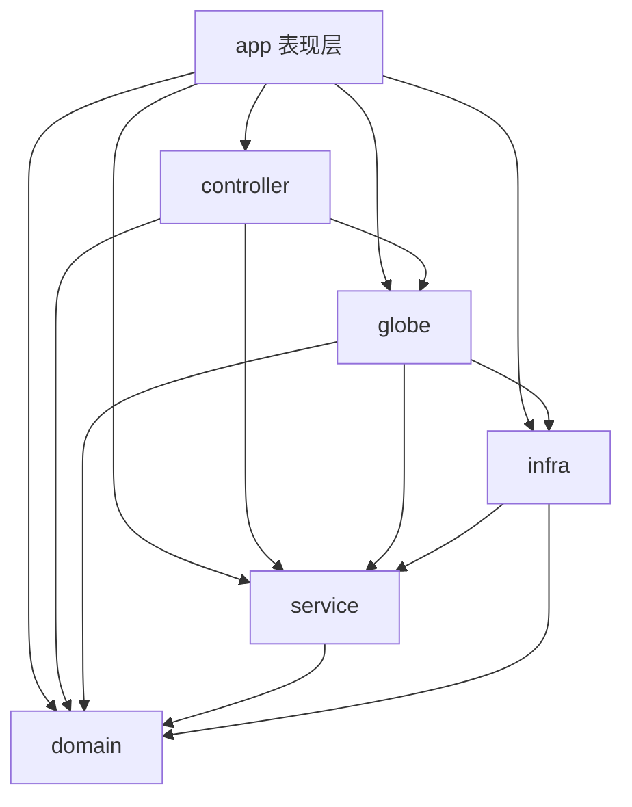
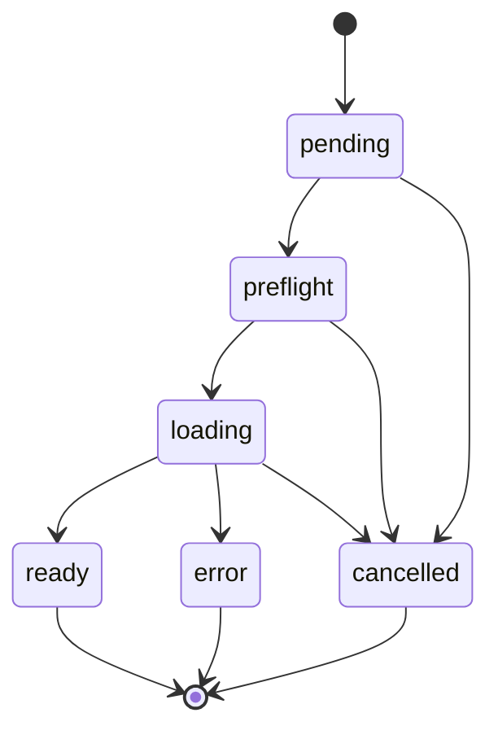

# CLAUDE.md — Earth Viewer · Agent 上手手册

> 本文件是 **Agent（Claude Code / Codex 等）接手本项目的工程与运行参考**：读完「0. 30 秒速览」就能正确操作，需要细节时按章节/任务索引查。视觉实现约束以根目录 `DESIGN.md` 为准。
> 改代码前请先通读本文件 + 相关源码；**带 ★ 的是"绝不可回退"的规则**，改动前务必三思。

---

## 图谱优先：主动使用 code-review-graph

凡涉及代码定位/调用链/架构说明/改动影响，先调用 `code-review-graph` MCP：`get_minimal_context_tool` 决定下一步，`get_architecture_overview_tool` / `query_graph_tool` 理解结构，`detect_changes_tool` + `get_review_context_tool` 评审，`get_impact_radius_tool` 判断影响；图缺失/过期先 `build_or_update_graph_tool`。不要默认通读文件或全仓硬搜。

## 0. 30 秒速览

- **项目**：画廊式 3D 地球图层应用。Cesium 渲染地球 + 接入 ArcGIS Online 公开图层（搜索 → 卡片添加按钮校验 → 叠加），线上 https://earth.gis2all.top
- **代码**：`D:\Code\earth-viz-hub`；git remote = `github.com/gis2all/earth-viewer`
- **技术栈**：React 18 · CesiumJS 1.144（★精确锁定）· Vite 5 · TypeScript 5.6 · zustand；Node ≥ 22；Vitest + Playwright；Docker；Cloudflare Pages

| 命令 | 用途 |
|---|---|
| `npm run dev` | 本地 http://127.0.0.1:5173（★strictPort，被占先停进程） |
| `npm run test:coverage` | 单测 + 覆盖率门禁（★statements/lines ≥ 90%） |
| `npm run lint` / `build` / `check:arch` | ESLint / 生产构建 / 层间依赖矩阵（★Cesium/MapLibre 收敛） |
| `npm run test:e2e` | Playwright E2E（含真实 ArcGIS） |
| `docker compose up --build` | Docker（5173） |
| `npx wrangler pages deploy --project-name=earth-viewer` | 部署 Pages（需 token，§13） |

**★ 不可违反**：1) 端口固定 5173（被占先停进程）；2) 未经用户准许不 `commit/push`；3) Cesium 锁 1.144.0；4) 层间依赖由 `check:arch` 强制（Cesium/MapLibre 仅 infra）；5) 生产 CSP `script-src` 含 `blob:`；6) UI 视觉以 `DESIGN.md` 为准、改 UI 先讨论；7) 不使用子 agent。

**任务索引**：加图层类型→§14 T1 · 加效果开关→T2 · 全套验证→T3 · 部署→T4 · 提交→T5 · 球空白→T6 · GPU 降级→T7

## 1. 项目定位

**Earth Viewer**：画廊式 3D 地球图层应用，目标是可以上线、不是 demo。左侧「图层」面板搜索 ArcGIS Online Web Map/Web Scene，点击卡片添加按钮校验并按类型叠加到 Cesium 球上；右侧「效果」面板调节环境/地形/视图；顶栏提供指北针/回正/复位/主题切换、GitHub 导航和应用内沉浸模式。深浅色双主题，全直角 UI。

### 1.1 UI 规范

根目录 [`DESIGN.md`](DESIGN.md) 是现有界面的视觉与交互实现约束（唯一来源），覆盖双主题令牌、布局尺寸、图层卡片、面板控件、滚动条、状态行为、无障碍要求和禁止回退项。任何 UI 改动前必须先阅读该文件；当代码与文档不一致时，应先确认哪一方代表最新已确认设计，再同步另一方。

---

## 2. 技术栈与依赖

| 依赖 | 版本说明 |
|---|---|
| React | 18.3.x |
| CesiumJS | **1.144.0**（★精确锁定，勿改回 `^`） |
| Vite | 5.4.x（`vite-plugin-cesium`，生产注入经典 Cesium.js） |
| TypeScript | 5.6.x（strict） |
| zustand | 4.5.x（全局状态 + persist localStorage `earth-viewer`） |
| proj4 / @mapbox/vector-tile / pbf | ArcGIS 数据转换：坐标重投影 / MVT 矢量瓦片解码 |
| maplibre-gl | 6.6.x：矢量瓦片官方样式（root.json）离屏渲染 → 自定义 ImageryProvider 喂给 Cesium |
| Vitest / Testing Library | 单测 + 覆盖率（v8 provider） |
| Playwright | E2E |
| Node.js | **≥ 22**（CI/Docker 统一 + `engines` 与 .npmrc `engine-strict` 本地强制） |
| Docker | 两阶段镜像（node:22-alpine），Compose 运行 |
| Cloudflare Pages + wrangler | 生产部署 |

- 渲染引擎是 **Cesium**；矢量瓦片样式渲染用 **MapLibre GL**（离屏栅格化后经自定义 ImageryProvider 贴到 Cesium 球上，见 §6.5）；无时间轴（已删除）。
- Cesium 深度封装只在 `src/infra/cesiumFacade.ts`；MapLibre 只在 `src/infra/arcgisVectorTileImageryProvider.ts`（§4.1 强制收敛）。

---

## 3. 运行方式

### 3.1 本地开发

```text
npm install
npm run dev        # http://127.0.0.1:5173
```

vite 内置 `/sharing` 代理（转发 `www.arcgis.com`，绕 CORS）。★开发端口固定 5173：被占时不得接受递增到 5174/5175，先停占用进程再启动（§17）。

### 3.2 生产构建 + Node 代理（自托管）

> ★maplibre worker 用 `import ... from 'maplibre-gl/dist/maplibre-gl-worker.mjs?worker&url'` + `worker.format='es'` 打包成自包含 ESM worker；否则生产只复制单文件、缺 shared 依赖 → 样式永不 load。

```text
npm run build               # dist/
node server/proxy.mjs 5173  # 静态托管 dist + /sharing 代理（默认 5173）
```

### 3.3 Docker

```text
docker compose up --build   # http://127.0.0.1:5173
docker compose down
```

两阶段：node:22-alpine 构建（npm ci + build）→ 运行（dist + proxy.mjs）。

### 3.4 Cloudflare Pages（生产线上）

- 线上：https://earth.gis2all.top（Pages 项目 `earth-viewer`，pages.dev 地址 `earth-viewer-9rw.pages.dev`）
- 本地 `npx wrangler pages deploy --project-name=earth-viewer`（GitHub 自动集成未启用）；详见 §13、§14 T4。

---

## 4. 架构总览

### 4.1 分层与依赖方向（check:arch 强制）



- `domain/`：零外部依赖纯 TS（类型/状态机/预算/配置/分类/几何）。
- `infra/`：Cesium / MapLibre 唯一入口（`CesiumFacade`、`ArcGISVectorTileImageryProvider`、`cameraActions` 等）+ `GpuMemoryManager`。
- `globe/`：`globeRenderer` 整图编排 + `webLayerRenderer` 按 kind 静态点表分发 + `globe/viewport` 视口驱动（数据加工下沉 `service/processing`）。
- `service/`：ArcGIS 数据入口、加载调度、视口数据加工。
- `controller/`：三个控制器，构造器注入依赖（deps），不 import Cesium / store。
- `app/`：表现层 + 组合根；不被反向导入。

★依赖矩阵（`scripts/check-arch.mjs` 强制，见 §10）：

| 源层 | 允许依赖 |
|---|---|
| `app` | controller / globe / infra / service / domain |
| `controller` | globe / service / domain |
| `globe` | infra / service / domain |
| `service` | domain |
| `infra` | service / domain |
| `domain` | （无） |

其它规则：1) Cesium / MapLibre 只允许 `src/infra/**`（测试豁免）；2) `src/testing/**` 仅测试可引用；3) 未知/已删目录（如 `src/state`）报错。改依赖方向后跑 `npm run check:arch`。

### 4.2 目录树（src 骨架）

```text
app/            AppShell / LayerPanel / EffectsPanel / GlobeViewer / store（§9）
controller/     layerController / cameraController / effectsController（§8）
service/        repository / scheduler / http / userLocation / arcgisItem（§7）
  formats/      csv / kml / ogc / vectorTile
  processing/   viewportWorker / viewportPipeline
domain/         types / config / renderContract / layerRuntime / webLayerKind / layerStateMachine / budgetPolicy
  geometry/     geometry / lru
infra/          cesiumFacade / gpuMemoryManager / cameraActions / arcgisVectorTileImageryProvider / scene / vector / webmapCamera / webmapProviders / primitive / gpuTiers（§6）
globe/          globeRenderer / webLayerRenderer / viewport（§6.4）
testing/        setup / mocks/cesium / integration
styles/         theme.css（全部样式，直角 + 深浅主题变量）
根目录：README / LICENSE / index.html / package.json / DESIGN.md / vite / vitest / eslint / playwright / wrangler 配置
public/         logo / covers / favicon-* / _headers（★CSP 唯一来源）/ _redirects
scripts/        badge.mjs / check-arch.mjs
functions/      sharing/[[path]].js（/sharing 代理）/ api/geo.js
```

### 4.3 数据流（一句话）

`LayerPanel` 并行搜索 → 点添加：容器 item `fetchWebmap` 取整图 / 单服务 `resolveServiceItem` 包装 → `store.addLayer` → `GlobeViewer` 差量同步 `LayerController`（唯一状态机 + `scheduler` 串行）→ `globeRenderer.renderWebmap`（相机优先、业务层上限、预算）→ `webLayerRenderer` 逐层分发 → `CesiumFacade` 上球；释放/错误/取消由控制器与调度器负责。

### 4.4 配置常量（domain/config.ts 唯一来源）

全部预算/相机/SSE/面板常量见 `src/domain/config.ts`（`configureApp` / `appConfig` / `resetAppConfig`）。关键易错值：业务层上限 5、SSE 缩放 2 → 稳定 1、自动环绕经度 `-0.0012`（方向见 §6.7）、`maxZoom 25,000km`、`autoRotateIdleMs 3000`。

---
## 5. 文件职责（改代码前先看这里）

| 文件 | 职责（关键点） |
|---|---|
| `domain/types.ts` | 13 种 LayerKind（webmap/webscene/map/feature/image/scene/vector/wms/wmts/wfs/kml/geojson/csv）+ RiskLevel |
| `domain/config.ts` | ★全部预算/相机/SSE/面板常量唯一来源（§4.4，见 `config.ts`） |
| `domain/webLayerKind.ts` | ★WebLayer 精细分类唯一入口：`classifyWebLayerKind`（按 layerType/type/内嵌要素集/URL 判定）；**不做注册表/adapter** |
| `domain/layerAssessment.ts` | ★"能否渲染"唯一事实源：能力表 `classifyLayer`、`assessWebmap`、角色分类、业务层上限；kind 复用 `classifyWebLayerKind` |
| `domain/layerStateMachine.ts` | 图层状态机（纯函数，§8.2） |
| `domain/renderContract.ts` / `layerRuntime.ts` / `budgetPolicy.ts` | 渲染任务契约 / 图层运行时资源表 / 预算策略 |
| `domain/geometry/` | 视口 envelope、点/线/面模型、跨点聚类、Douglas-Peucker 抽稀 + LRU |
| `service/repository.ts` | ★ArcGIS 请求与缓存唯一收口（搜索/元数据/预检/分页，§7.1） |
| `service/scheduler.ts` | 视口优先级 + 串行渲染调度（`LayerScheduler(1)`） |
| `service/http.ts` | 唯一 fetch 出口（15s 超时、429 退避、重试） |
| `controller/layerController.ts` | ★图层生命周期唯一状态机：runtime + abort + viewport + 串行队列（§8.2） |
| `controller/cameraController.ts` | 相机交互收编：滚轮/双击/自动环绕/SSE 迟滞/idle 唤醒（§6.7） |
| `controller/effectsController.ts` | 效果/主题变更 → 场景副作用（§6.8） |
| `infra/cesiumFacade.ts` | ★Cesium 深度封装唯一入口；其余地方不散见 `Cesium.`（§6.2） |
| `infra/gpuMemoryManager.ts` | ★统一 GPU 内存预算/降档（§6.6） |
| `infra/arcgisVectorTileImageryProvider.ts` | ★VectorTile 官方样式 MapLibre 离屏栅格化 → ImageryProvider（§6.5） |
| `infra/gpuTiers.ts` / `webmapProviders.ts` / `scene.ts` / `vector.ts` | GPU 档位 / provider 构建（Cesium 适配）/ 3D Tiles + I3S / 重投影 + renderer→样式 |
| `app/GlobeViewer.tsx` | 瘦组件：创建 Facade + 订阅三个 Controller + 转发渲染唤醒；相机优先/userHome 回退；上报相机 heading（指北针）；★`window.__E2E__` 跳过 Cesium |
| `app/AppShell.tsx` | 布局、品牌、favicon 主题切换、指北针/回正/复位、GitHub、沉浸模式（§9.2） |
| `app/LayerPanel.tsx` / `store.ts` | 画廊：搜索/预检/流式/添加移除/toast（§9.1）/ zustand + persist（§8.1） |
| `globe/globeRenderer.ts` | renderWebmap 编排：相机、业务层上限、跨层预算、错误与清错时机 |
| `globe/webLayerRenderer.ts` | WebLayer 按类型渲染：静态有序分发表 + 每类渲染器（不做注册表/adapter） |

---

## 6. 渲染核心（★别改坏）

### 6.1 底图与地形（★）

- 底图单数据源 = Imagery Hybrid (WGS84) 影像 + 矢量标注（`WORLD_VECTOR_LABELS_STYLE_URL`，MapLibre 离屏）；**不再叠加 3857 World_Imagery / Boundaries**。
- 标注样式：`language:'en'`（★固定英文）、`labelsOnly:true`、白字 + 黑描边、`textScale` z6 1.15 → z16 1.6。
- 地形 `Terrain3D (GCSv2)`，EPSG:4326（★必须 4326——3857 截断 ±85.05°，极区无 tile）。

### 6.2 CesiumFacade（infra 唯一深接触点）

Viewer：`requestRenderMode:true` + `maximumRenderTimeChange: Infinity` + `useBrowserRecommendedResolution:false`（跟随系统 DPI）+ `tileCacheSize: 100` + bloom 关 + `globe.baseColor #0d1526` + `webglcontextlost/restored` 监听；注册到 GpuMemoryManager `'scene'`。方法清单见源码，分组：生命周期 / 相机状态 / 相机命令 / 交互 / 效果（`setAtmosphere*`、`setSunGlow`、`setAtmosphereRing`、`setVerticalExaggeration`、`setTranslucency`）/ 地形 / 底图 / 上球 / 视口释放。

### 6.3 按需渲染（★别回退）

固定 `requestRenderMode:true`：静止不持续提交 GPU 帧；效果/地形/影像/DataSource/Primitive/VectorTile/删除/`flyTo`/`webglcontextrestored` 改变场景后统一走 `CesiumFacade.requestFrame()`。滚轮缓动与自动环绕仅在动画期间请求下一帧；**不得**在静止路径无条件 `requestRender()`，也**不得**每帧重复写相同 SSE。

### 6.4 图层评估与加载

- ★图层分类唯一入口 `classifyWebLayerKind`：供 `layerAssessment` / `loadSafety` / `webmapProviders` / `webLayerRenderer` 复用，字段优先级与正则不四处重复。
- 能力表 `classifyLayer`：`full`（MapServer/ImageServer 瓦片、动态 export、带名 WMS/WMTS、KML、VectorTile）/ `partial`（FeatureLayer/GeoJSON/CSV/WFS/OGC 降级、I3S、3D Tiles、WMS 缺名）/ `none`（无地址或明确不支持）。
- 角色 `basemap`/`overlay`/`business`；★overlay 走 URL 黑名单（Hillshade 等）且**不渲染**（否则灰度盖底图=全白）。
- 投影 `detectCrs`：4326 → Geographic；其余/失败 → Web Mercator；`CRS_CACHE` 缓存。
- KML：`parseKmlToGeoJSON` → `runViewportProcess`（预算）→ GeoJsonDataSource，失败回退原生 `KmlDataSource.load`（受 2MB 限制）。
- 渲染分发：`webLayerRenderer` 静态有序分发表消费 `is*Input` 兼容视图；**不做全局注册表 / LayerAdapter**。
- FeatureLayer 视口管线：moveEnd 250ms 防抖 → `resolveFeatureQueryBase` → `query geometry=envelope f=geojson` → Worker 解析/抽稀/预算 → Primitive。

### 6.5 矢量瓦片（ArcGISVectorTileImageryProvider）

- MapLibre 离屏 512px 栅格化 → Cesium `ImageryProvider`；3×3 块批量 + 单次快照读回（快照后立即弃用 renderStyle，改按独立 tile 块渲染，避免跨块图钉跨单元偏移）。
- ★必须读 `getCenter()` 实际中心（不能假定 `jumpTo()` 请求中心，否则错取相邻瓦片——数十度偏移）。
- 每块等 MapLibre `idle` 才缓存（瓦片/字体/sprite 稳定）。
- ★**并行实例池 + 每实例严格串行**（默认 pool 按档位）：`_drain()` 只把块派给空闲实例，任务完成才置回；**不得轮询复用**——同一 canvas 被并发 `jumpTo`/快照会读到别的块帧，标注整体错位约 90°。
- `normalizeArcGISStyle`：VectorTileServer（含相对 `../../` URL）→ XYZ PBF 模板；移除非法 `tileSize`；无 sprite 时移除 icon-image。
- 销毁时拒绝所有未决瓦片请求。

### 6.6 GPU 内存管理（GpuMemoryManager）

统一核算 + 四档降级，目标：GPU OOM / context lost 后**降级不崩溃**（提示而非白屏）。

| 档位 | canvas | block | pool | cache | scale | offscreenPaused |
|---|---|---|---|---|---|---|
| high | 1536 | 3 | 2 | 12 | 1 | false |
| medium | 1024 | 2 | 2 | 8 | 1 | false |
| low | 512 | 1 | 1 | 6 | 0.75 | false |
| critical | 512 | 1 | 1 | 4 | 0.5 | true |

- 默认预算约 256MB；低内存按 `deviceMemory` 收紧。`reportContextLost()` 每丢一次降一档（1→medium、2→low、3→critical）；核算从"当前档位与丢失上限更严格者"逐级下探。
- ★档位**只降不升**：避免 provider 重建期间升降档反复造成重建风暴；内存释放后 `unregister` 可升档。
- 档位经 `subscribe` 通知 `_applyTier` → resolutionScale + 重建全部 vector provider（token 防竞态）；critical 档 moveStart/moveEnd 懒注册（相机静止暂停离屏出图，★只作用于业务矢量图层——**底图标注豁免**，否则降档后 `_drain` 早退导致底图在而标注丢）；MapLibre context lost → `gpu.reportContextLost()`。

### 6.7 相机（★别回退）

- 右键拖拽=倾斜；滚轮=平滑缩放（目标高度缓动）；双击=zoom in 一半高度。
- ★所有飞行统一 `flyTo`；任何鼠标按下 `cancelFlight()`（否则飞行中拖不动球）。
- 瓦片清晰度：缩放中 SSE=2 → 稳定后=1（迟滞）。★Viewer 固定 `useBrowserRecommendedResolution:false` 跟随系统 DPI；高分屏不清是 DPR 问题，别靠加大 SSE。
- ★自动环绕**东西方向**：`setView` 经度递减 `-0.0012`（相机向西），保持纬度/高度/朝向——不是原地转 heading；静止 3000ms 后开始，滚轮后 1500ms 内不触发。
- ★相机/用户定位：带 `viewpoint.camera` → 飞其相机（3857 反投影 + heading/tilt）；无相机 → `flyToHome()`（`userHome` + `initialHeight`）。首次进入加载完成后自动居中到 `userHome`。`userHome` 来自 `/api/geo`，失败回退 `(35,104)`；★本地 dev `/api/geo` 404 → 走兜底。

### 6.8 效果面板 & 沉浸模式

- ★面板折叠/展开用整体 `transform: translateX`（左 -100%、右 +100%，220ms），宽度全程保持最终值；内容不参与重排。不得回退为 width 动画（宽度过渡期卡片网格重排，像"从上方涌出来"）。
- 环境：大气光晕/大气散射/星空/日月/太阳光晕（滑杆，仅日月开启时显示）/雾效/昼夜光照；地形：地形透明（开关+透明度滑杆，随开关显隐）、地形夸张 1–100；视图：自动环绕（区划/参考网格恒开、无面板开关）。
- 顶栏全屏图标进入沉浸模式：隐藏顶栏 + 左右面板，仅保留球体与退出图标；会话级，退出或 `Esc` 恢复。
- ★半透明必须显式设 `frontFaceAlpha`/`backFaceAlpha`（默认 1；正面=滑杆值，背面=`min(1, 值+0.1)`）。
- ★实验组（云层/水面/极光）已删除勿加回；Bloom 关。

---
## 7. 数据与搜索

### 7.1 repository（src/service/repository.ts）

所有 Repository 数据访问经 `http.ts` 的 `fetchJson`（统一超时/退避/重试），不散见 fetch。关键导出：`SEARCH_TYPES`/`SEARCH_PAGE`(12)、`AUTHORITATIVE_FILTER`（`contentstatus` 权威）、`fetchSearchPage`、`mergeSearchResults`（numViews 降序 + 按 id 去重）、`fetchItemMetadata`（补齐 contentStatus/groupDesignations）、`preflightService`/`preflightItem`（服务探测，3s 超时、24h 缓存）、`fetchWebmap`、`detectMapService`（tileInfo 判 tiled/dynamic + 投影缓存）、`fetchFeatureGeoJSON`（分页 + 预算截断）、`fetchFeatureRenderer`（drawingInfo.renderer 样式）。

### 7.2 搜索与画廊

- 13 类型白名单并行搜索（`sortField=numViews`）；权威以 `contentStatus`（org/public_authoritative）为准，Living Atlas 判 `groupDesignations` 而非 typeKeywords。
- 预检与元数据补齐并发 4（每项 3s 超时、24h 缓存、按 id 控制总量，429 限流）。
- 按批流式上屏 `galleryPage 24` / `appendStep 12`；无限滚动写前判 requestId 防串流。

### 7.3 http（src/service/http.ts）

`fetchJson`：15s 超时、429 退避重试（最多 2 次 + 抖动）、`AbortSignal.any`；`markRateLimited`/`wasRecentlyRateLimited`（60s，防雪崩）；`HttpError`/`TimeoutError`。

### 7.4 共享代理

`functions/sharing/[[path]].js` 只放行白名单路径，GET/HEAD-only + Origin 检查（`ALLOWED_ORIGIN`）+ 内存限流；非白名单路径 403 属预期。

---

## 8. 状态与控制器

### 8.1 store（src/app/store.ts）

zustand + persist（key `earth-viewer`）；`partialize` 只持久化 `theme / collapsed / collapsedRight / added / effects`。`Effects` 字段：`atmosphereRing / atmosphere / stars / sunMoon / sunGlow / fog / dayNight / terrainExaggeration / globeTranslucency / translucencyAlpha / autoRotate / showReferenceLayers`（`showReferenceLayers` 恒开、无面板开关）。

### 8.2 LayerController 状态机（★唯一）



- 状态 `pending → preflight → loading → ready / error / cancelled`（`cancelled` 终态）；事件 `stateChange/ready/error/removed`。
- `setItems` 按 id 差分；`remove` → `entries.delete` + `scheduler.cancel(id)` + `abort.abort()` + 置 `cancelled`；异步早退/晚到 onError 用 `entries.has` 守卫 + stale errors 清理，避免脏状态/泄漏。
- 渲染串行：同一时刻只渲染一个 webmap（`LayerScheduler(1)`）；`priority()` 实时插队（缺省 0 = 添加顺序）；`cancel` 只移排队，运行中由 AbortSignal 中断。渲染经 `deps.render` 委托，不 import Cesium/store。

### 8.3 CameraController

依赖 `CameraSurface`（`setView / flyToLonLat / pickLonLat / onWheel / onPointerDown / onDoubleClick / onPostUpdate`）。交互参数见 §4.4 / `config.ts`：滚轮 1.25/0.8、双击 0.5、自动环绕经度 `-0.0012`（§6.7）、SSE 缩放 2 → 稳定 1、idle 3000ms、wheelActiveWindowMs 1500。

### 8.4 EffectsController

依赖 `EffectsSurface`（`setAtmosphere*`、`setSunGlow`、`setAtmosphereRing`、`setVerticalExaggeration`、`setTranslucency`、`requestFrame`）；`sync()` 应用 store 效果并唤醒相机 + 请求一帧。深色背景 `#05070d` / 浅色 `#ffffff`（与 DESIGN surface 一致）。

### 8.5 GlobeViewer（组合根）

创建 CesiumFacade + 三控制器；`added` 差分同步 LayerController（`added.filter(a => a.kind==='webmap' && a.webmap)`）；userHome 经 `setUserHomeResolver` 注入；★`window.__E2E__` 跳过 Cesium。

## 9. 表现层

### 9.1 LayerPanel（画廊）

- 搜索：13 类型白名单并行 `fetchSearchPage`（SEARCH_PAGE=12），`mergeSearchResults` 按 numViews 降序去重；支持关键词输入。
- 预检：可见项批量 `preflightItem`（3s 超时、24h 缓存、requestId 防串流）；预检通过才渲染"可添加"状态，避免"点了没反应/白屏"。
- 流式上屏：分批 append（galleryPage 24 / appendStep 12）。
- 添加/移除：`store.addLayer` / `store.removeLayer`；添加按钮 hover 提示；detail 图标跳详情页。
- 封面：`covers/default.png` 默认封面 + 加载动画（thumbTimeoutMs 60s 超时兜底）。
- 无限滚动：游标/缓冲写入前判断 requestId，避免旧请求写入新搜索。

### 9.2 AppShell（顶栏/布局）

- 品牌/favicon 随主题（dark/light 两套 SVG）；指北针（`orientNorth`，只转方向保俯仰）与回正/复位（cameraActions）、主题切换、GitHub 导航、沉浸模式（隐藏顶栏+左右面板，仅保留球与退出图标）。

### 9.3 EffectsPanel（效果）

- GROUPS 结构：环境（大气光晕/大气散射/星空/日月/太阳光晕/雾/昼夜）、地形（透明+滑杆、夸张 1–100）、视图（自动环绕）；开关/滑杆视觉规格见 DESIGN.md。

### 9.4 面板折叠动画（★别回退，见 §6.8）

### 9.5 图层卡片 / 滚动条 / 图标

- 视觉约束全部归 DESIGN.md（唯一来源）：卡片尺寸与间距、13 类型图层 icon、detail/添加数据图标、滚动条样式与箭头、hover 状态、主题色令牌。改这些之前先读 DESIGN.md 并与用户确认。


### 9.6 底部状态栏（BottomStatusBar）

- 居中横条，位于球体底部。左/右收窄按面板开合与沉浸模式自动伸缩：沉浸或对应面板折叠时占满全宽，否则避开面板宽度（与 `.panel` clamp 一致）。
- 左段：位置（`位置: ` + 经°E/纬°N）+相机高度（km，2 位小数）。鼠标悬停时经纬度跟随指针；无鼠标数据时用相机中心。
- 右段：`Powered by gis2all`（已去 logo、合并为整体文本），与左段同 muted 色系。横条背景与面板一致、无边框。

---

## 10. 测试与质量门禁

- **单测**：Vitest（jsdom），**540 个用例 / 42 个文件全过**（2026-09-04 `output/test-results.json` 实测）。`npm run test:coverage`
- **覆盖率门槛**（vitest.config.ts）：★statements ≥90 / lines ≥90 / functions ≥85 / branches ≥70；include **全 src**，exclude 入口壳（`main.tsx` / `App.tsx`）、测试文件与测试基建（`src/testing/**`）、`service/processing/viewportWorker.entry.ts`、`infra/primitive.ts`——真实口径，不玩数字。
- **覆盖率实测**（2026-09-04）：statements **94.01** / branches **86.53** / functions **95.65** / lines **96.95**。
- **架构门禁**：`npm run check:arch`（scripts/check-arch.mjs，含 lint）——全依赖矩阵（§4.1）：Cesium/MapLibre 仅限 `src/infra/**`（测试豁免）、domain 零外部依赖、app 不被反向导入、未知层目录报错；CI 已跑此步。
- **E2E**：Playwright **35 项**（app.spec 2 / ui.spec 14 / integration.spec 19；integration 走真实 ArcGIS，具体以 CI/output/e2e-results.json 为准）。★E2E 轻量模式：`app.spec.ts`、`ui.spec.ts` 注入 `window.__E2E__`，GlobeViewer 跳过 Cesium 创建（CI 无头软件渲染极慢）；「球真实渲染+图层上球」由线上/容器验证覆盖。
- **徽章**：6 个（CI / License / Coverage / Deps / Tests / E2E）；`scripts/badge.mjs` 从 coverage-summary/audit/output/test-results/output/e2e-results 生成 → GitHub Actions 发布 → shields endpoint 渲染，每次 CI 实时生成。
- **CI**（.github/workflows/ci.yml）：audit（--omit=dev）→ check:arch（含 lint）→ test:coverage → build → e2e → badge → upload-pages-artifact（main 分支 deploy 到 Pages）。
- 每次改动建议验证顺序：`npm run lint` → `npm run check:arch` → `npm run test:coverage` → `npm run build` → `git diff --check`。

---

## 11. 已知限制（Cesium 能力边界）

- ArcGIS VectorTileLayer 用 MapLibre 按官方样式离屏渲染（`ArcGISVectorTileImageryProvider.ts`），不依赖 `MVTDataProvider`；WebScene 纯 `styleUrl` 直接用 `styleUrlForLayer` 取样式。低缩放/高密度区域（如 z3 亚洲）单帧绘制耗时偏高，headless 软件渲染更明显，真机 GPU 正常。部分 ArcGIS 样式引用的 sprite 图标可能在 MapLibre 中缺失；连续缩放的位置一致性仍需以真实浏览器视觉回归确认。
- 当 WebGL 上下文丢失（内存不足/卡死）时：`webglcontextlost` → GpuMemoryManager 降档 + 重建失效 provider，显示降级提示而非白屏（§6.6）。降档不是显存硬上限，超重型叠加仍可能触发系统级 GPU 进程重启。
- 3D Tiles / I3S 已设 cacheBytes=128MB / overflow=32MB；WMTS、动态 MapServer export 已设 maximumLevel 上限。
- 动态 MapServer/ImageServer 使用 `/export` 的 4326 影像兜底；不依赖 `/tile/`。
- WMS/WMTS/KML 支持（KML 先转 GeoJSON 走预算，失败回退原生）；Feature/GeoJSON/CSV/WFS/OGC API Features 转 GeoJSON 降级渲染；属性/符号分级部分丢失。
- 瓦片 metadata 探测失败静默回退 3857（可能错位但不崩）。
- dev 链 vite→esbuild 已知漏洞（升 vite 8 breaking，暂缓，勿 `npm audit fix --force`）。
- ArcGIS 匿名访问有速率限制（429），预检与元数据补齐均并发 4（每项 3s 超时），按 id 缓存 24h 控制总量。
- 本地 dev 无 Cloudflare，`/api/geo` 404 → `userHome` 回退 `(35,104)`。
- Web Scene 的 `viewingMode:'local'`（局部坐标系）相机暂未覆盖，仅处理 global。
---

## 12. 设计决策（为什么）

| 决策 | 原因 |
|---|---|
| 分层 DI + domain 零依赖纯 TS + Cesium/MapLibre 仅 infra | 层间依赖可测、引擎引用收敛、类型不被绑架；新增类型走 §14 T1，不改全局注册表 |
| 统一评估器 `layerAssessment` + 统一分类 `classifyWebLayerKind` | "能否渲染 / 什么类型"收敛单一入口，能力表只做决策 |
| 不做 LayerAdapter / 独立 loader 主链路 | 数据取回/转换已分布在各 provider/renderer，没有真实消费方 |
| 统一 GpuMemoryManager 四档降级、档位只降不升 | 单一核数 + 防重建风暴；context lost 降档避免白屏 |
| 地形/影像用 4326 | 3857 截断 ±85.05°，极区无 tile |
| 跳过 overlay 辅助层（Hillshade） | 单独渲染=全球灰度盖底图=全白 |
| 投影自动探测 | 4326 按 3857 解释会条纹错位 |
| 画廊预取+过滤、按批流式上屏、搜索按 numViews | 列表只显示能用的、首卡快、默认相关度全 VectorTile |
| 端口 5173 / Node 22 | 避免端口与版本割裂 |
| Cesium 按需渲染 | 静止不持续提交 GPU 帧；异步数据后显式请求一帧 |
| 生产经典 Cesium.js + CSP blob: | worker 走 blob importScripts |
| 矢量瓦片用 MapLibre 栅格化（非 MVTDataProvider） | 复用官方样式；裸几何难复现、全球 MVT 内存爆炸 |
| 标注固定 language:'en' | 当前仅英文；未来本地化再走 'local' |
| 相机优先 / 用户位置回退、/api/geo 兜底 | 有 `viewpoint` 用作者视角；自托管不弹授权 |
| Cloudflare Pages 而非 Workers、`wrangler pages deploy` | Workers 类型会导致 deploy 报错 |

## 13. 部署与上线（Cloudflare Pages）

- **线上**：https://earth.gis2all.top（Pages 项目名 `earth-viewer`；pages.dev 备用域名 `earth-viewer-9rw.pages.dev`）。
- **项目来源**：由 Cloudflare API 创建（Direct Uploads 类型，非 GitHub 集成）；**连接 GitHub 自动部署未启用**，部署靠本地 wrangler 命令。
- **部署命令**：`npx wrangler pages deploy --project-name=earth-viewer`（读取 `wrangler.toml` 的 `pages_build_output_dir=dist` + `functions/`）。
- **前置条件**：
  - `CLOUDFLARE_API_TOKEN`（★必须含 `Account > Cloudflare Pages > Edit` 权限；"Edit Cloudflare Workers" 模板**不含** Pages 权限 → 10000）
  - `CLOUDFLARE_ACCOUNT_ID=20e8a62a0f78502e23ef1be970f9e5cb`
  - ★`wrangler.toml` **不能含 `account_id`**（Pages 配置校验会报错）；不能写 `[assets]`（那是 Workers 模式）
- **环境变量（Pages 项目）**：`ALLOWED_ORIGIN=https://earth.gis2all.top`（★必设，否则浏览器请求被代理 Origin 检查 403）。
- **构建配置**：build command `npm run build`，输出 `dist`，生产分支 `main`；**Builds 设置里的 build token 若失效**（"belongs to a user who left"）需在 dashboard 换新。
- **CSP 与安全头（★生产渲染依赖）**：
  - CSP 唯一来源 `public/_headers`（index.html **无**内联 CSP）；`script-src 'self' 'unsafe-inline' 'unsafe-eval' blob:`、`worker-src 'self' blob:`。
  - ★`script-src` 的 `blob:` 绝不能删：生产经典 Cesium.js 把 worker 内联 base64，worker 用 `importScripts(blob:)`，被拦则**球空白**（dev ESM 构建无此问题）。
  - `functions/sharing/` 代理加固见 §7.4；CI 审计生产依赖。
- SPA 回退 `public/_redirects`（`/* /index.html 200`）。
- 域名绑定：`earth.gis2all.top` CNAME → `earth-viewer-9rw.pages.dev`（已在 Cloudflare 完成）。
- `functions/api/geo.js` 是 Pages Function，随 `functions/` 一起部署；`/api/geo` 读 `CF-IPCountry` 返回用户国家质心经纬度。

---

## 14. 任务式操作指南（Agent 干活时照着做）

### T1 加一个图层类型（如 CSV）
1. `domain/types.ts` → `LayerKind` 加类型；`domain/webLayerKind.ts` → `WebLayerKind` + `classifyWebLayerKind` 规则（显式类型/URL 回退），需渲染兼容时同步 `is*Input`。
2. `domain/layerAssessment.ts` → `classifyLayer` 能力表加 full/partial/none。
3. `infra/webmapProviders.ts` → `providerForWebLayer`（或 DataSource 分支）写逻辑；`globe/webLayerRenderer.ts` → 点表加一类渲染器（顺序见文件头）。
4. 补三处测试 + 跨模块一致性用例，跑 `test:coverage`。
5. 更新 §5 / §11。

### T2 加一个效果开关
1. `app/store.ts` → `Effects` 加字段+初始值；`app/EffectsPanel.tsx` → GROUPS 加开关/滑杆项；`controller/effectsController.ts` → `sync` 应用（唤醒相机+请求一帧）。补测试。

### T3 全套验证
```text
npm run lint
npm run check:arch      # 改过依赖方向必跑
npm run test:coverage   # 门槛不过 = CI 红
npm run build
npm run test:e2e        # 需网络（真实 ArcGIS）
docker compose up --build && 浏览器验证   # 有 Docker 改动时
```

### T4 部署 Pages
```powershell
$env:CLOUDFLARE_API_TOKEN = "<Pages Edit token>"
$env:CLOUDFLARE_ACCOUNT_ID = "20e8a62a0f78502e23ef1be970f9e5cb"
npm run build
npx wrangler pages deploy --project-name=earth-viewer
# 验证：curl https://earth.gis2all.top/ 与 /sharing/rest/search
```

### T5 提交
1. 未经用户明确准许不提交（★，§17）。
2. 分功能批次：`git add <具体文件>` + `git commit -m "<英文 message>"`。
3. 用户说"推送"才 `git push origin <分支>`，需 PR 按之前格式。

### T6 排查"球空白 / 静止不刷新"
1. 生产/Docker → 检查 `_headers` CSP `script-src` 含 `blob:`（★常见根因，§13）。
2. dev 正常生产空白 → 经典 Cesium.js worker blob 被 CSP 拦（§13）。
3. 刚改图层加载 → 看 `layerErrors` 红标 / `fetchFeatureGeoJSON` 分页。
4. 新图层/异步数据在静止球不出现 → 确认场景变更后经 `CesiumFacade.requestFrame()` 请求一帧；勿关 `requestRenderMode` 绕（§6.3）。

### T7 排查 GPU 内存 / 上下文丢失
1. 有无 `webglcontextlost` → `reportContextLost()` 已降档、provider 重建（§6.6）。
2. 多次 context lost → 查 `contextLostCount()` / 当前档位，确认瓦片 pool/cache 按档收缩。
3. 矢量标注错位 → 检查是否违反"每实例严格串行"（§6.5）。
4. 常规：减少叠加（业务层上限 5）、清理大 Feature/GeoJSON、恢复默认分辨率。

## 15. 待办

- 矢量瓦片连续缩放的视觉一致性回归（真实浏览器）
- Web Scene `viewingMode:'local'` 相机支持（当前仅 global）
- 高/多数据叠加时偶发 WebGL context lost（GPU 内存压力）——目前降档 + 重建 provider，仍可能触发，需真实设备复现。
- 部分 WebMap（如 Streets）放大后再缩小并切换到其它地点，停止渲染导致变糊——需真实浏览器视觉回归确认。


---

## 16. 历史踩坑（防回归）

| 现象 | 根因 | 当前规则 |
|---|---|---|
| 南北极空白 | 3857 地形截断 ±85.05° | 4326 地形 + 4326 影像底层（§6.1） |
| 4326 图层条纹花屏 | provider 写死 3857 tilingScheme | 探测 wkid，4326 → Geographic |
| 地图全白（Charted Territory/US Wildfire） | Hillshade 灰度辅助层盖底图 | 跳过 overlay 辅助层 |
| 地球半透明没效果 | alpha 默认 1，只开 enabled | 显式设 front/backFaceAlpha |
| 自动旋转方向不对 | 原地递增 heading / 经度递增 | 经度递减（相机向西、自西向东） |
| favicon 与网页图标不一致 | favicon 固定白球 | dark/light 两套 SVG 随主题 |
| 图层多次加载/取消残留 | 异步竞态 | LayerController 增量同步 + 取消令牌 + 串行队列 |
| 图层移除后晚到错误写脏状态 | 异步 onError 无守卫 | `entries.has` 守卫 + stale errors 清理（§8.2） |
| flyTo 期间拖不动球 | 飞行未取消 | 鼠标按下 cancelFlight |
| 瓦片缩放模糊 | SSE 固定 | 缩放中 2 → 稳定 1（迟滞）；`useBrowserRecommendedResolution:false` 跟随 DPR |
| 球体蓝块 | 底图未加载露底色 | 基色 #0d1526 |
| Docker/生产球空白 | 经典 Cesium.js worker 走 importScripts(blob:)，CSP script-src 无 blob: | CSP 加 blob:（★勿删，§13） |
| 画廊 90s+ 空白 | 凑满 24 可渲染项才 setItems | 按批流式上屏 |
| 画廊没数据 | ArcGIS 默认相关度首页全 VectorTile | 搜索带 sortField=numViews |
| 无限滚动 items 膨胀 / 串数据 | 旧请求游标写入新搜索 | 游标/缓冲写入前判断 requestId；追加用本批 partial |
| 缩略图已加载但加载环一直显示 | SVG `hidden` 在 Chromium 不生效 | CSS `.thumb-spinner[hidden]{display:none}` |
| 标注整体错位约 90° | 同一 MapLibre canvas 被并发 jumpTo/快照复用 | 每实例严格串行，任务完成才置回空闲（§6.5） |
| 矢量瓦片/标注低空看不清 | 字号未随层级放大 | textScale z6 1.15→z16 1.6 + 白字黑描边 |
| GPU OOM 后白屏/崩溃 | 显存耗尽、上下文丢失 | GpuMemoryManager 四档降级 + context lost 降档重建（§6.6） |
| 档位反复横跳触发重建风暴 | register/unregister 导致升降档 | 档位只降不升 |
| Cloudflare：wrangler deploy 报 Missing entry-point | 用 Worker 命令部署 Pages 项目 | 用 `wrangler pages deploy` |
| Cloudflare：Pages 项目不存在 | 建成了 Workers 项目（非 Pages） | 确认项目类型（API 查 pages/projects） |
| Cloudflare：认证 10000 | token 无 Cloudflare Pages Edit 权限 | token 必须含 Pages > Edit |
| Cloudflare：build token 失效 | 绑定已离开用户的 token | dashboard Builds → API token 换新 |
| Cloudflare：wrangler.toml 报错 | 含 account_id（Pages 不支持） | 去掉 account_id，用环境变量 |

---

## 17. 工程约定

- ★**未经用户明确准许，不得执行 `git add` / `git commit` / `git push`**；只有用户明确说「提交/推送」才执行。
- `docs/` 已废弃（目录已删，`.gitignore` 仍保留以防误提交）；`coverage/`、`test-results.json`、`e2e-results.json`、`audit.json`、`*.log`、`*.tsbuildinfo`、`node_modules/`、`dist/`、`output/` 已忽略。
- **命名规范**：`.ts` 模块文件一律 camelCase（如 `cesiumFacade.ts`、`gpuMemoryManager.ts`、`arcgisVectorTileImageryProvider.ts`、`webmapProviders.ts`、`globeRenderer.ts`、`webLayerRenderer.ts`、`viewportWorker.entry.ts`）；仅 React 组件/入口 `.tsx` 用 PascalCase（`AppShell.tsx`、`GlobeViewer.tsx`、`App.tsx`，`main.tsx` 按惯例小写）；导出类/接口名保持 PascalCase（如 `CesiumFacade`、`GpuMemoryManager`、`ArcGISVectorTileImageryProvider`），Esri 拼写统一 `ArcGIS`（含 `ArcGISSymbol`、`normalizeArcGISStyle`）；测试文件与源文件同名（`*.test.ts` / `*.test.tsx`）。
- 开发日志、临时测试输出、预览页面等一律放 `output/`（**不要直接放项目根目录**）：日志与测试产物进 `output/logs/`（如 `output/logs/dev.log`），临时脚本进 `output/scripts/`（如 `output/scripts/apply-renames.py`）；vitest/playwright 的 JSON 报告输出到 `output/test-results.json` / `output/e2e-results.json`。
- ★开发服务器端口固定为 5173（§3.1）：启动前执行 `Get-NetTCPConnection -LocalPort 5173 -State Listen`，确认占用进程后用 `taskkill /PID <listenerPid> /T /F` 停止对应进程树，再执行 `npm run dev -- --host 127.0.0.1 --port 5173 --strictPort`；禁止默默使用 5174/5175。
- Windows 写文件用 apply_patch 或 Python/Node（utf-8、BOM-free、LF）；编码敏感文件（package.json、*.tsx/*.ts、*.md、*.html、*.yml 等）别用 PowerShell 重定向写。
- 用户全中文交流，回复用中文；讨厌"AI 感/太文艺"。
- 用户对 UI 要求苛刻，**改 UI 前先讨论/看原型**；视觉细节归 DESIGN.md（§1.1）。
- 不要使用子 agent（用户明确要求）。
- Docker/部署改动后必须实测（容器或线上验证球渲染与画廊），不能只看构建通过。
