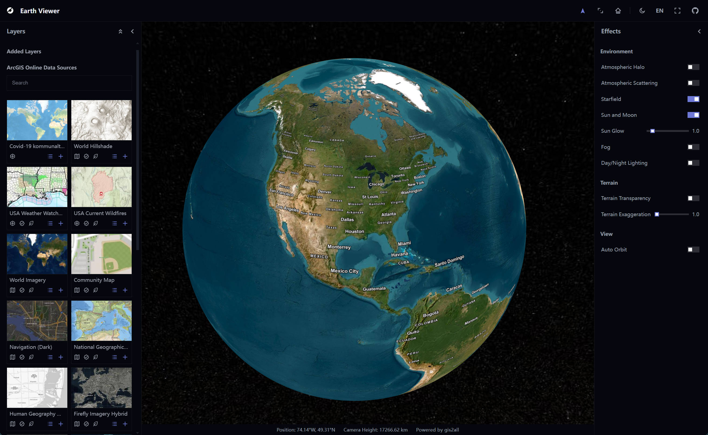
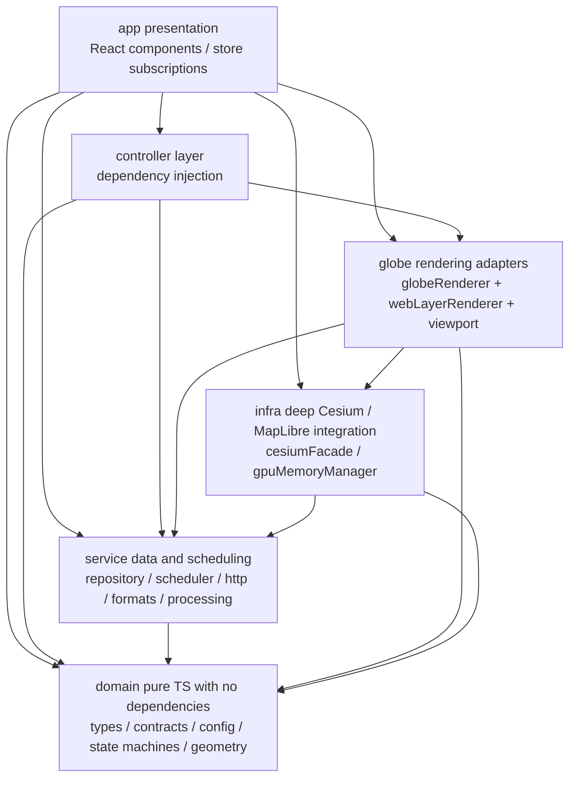

#  Earth Viewer

[](README.CN.md)
[](https://github.com/gis2all/earth-viewer/actions/workflows/ci.yml)
[](https://gis2all.github.io/earth-viewer/)
[](https://github.com/gis2all/earth-viewer/actions)
[](https://github.com/gis2all/earth-viewer/actions)
[](https://github.com/gis2all/earth-viewer/actions)
[](LICENSE)

A 3D globe layer application built with Cesium. It integrates public ArcGIS Online layers for searching, adding, overlaying, and managing map layers while adjusting globe effects in real time.



## Tech Stack

| Technology | Responsibility |
| --- | --- |
| React 18 | UI components |
| CesiumJS | 3D globe rendering |
| TypeScript 5.6 | Type safety |
| Vite 5 | Development and build tooling |
| zustand | Global state and persistence |
| proj4 / @mapbox/vector-tile / pbf | ArcGIS data conversion |
| maplibre-gl | Offscreen rasterization of official vector-tile styles into a custom ImageryProvider |
| Vitest / Testing Library | Unit testing |
| Playwright | End-to-end browser regression testing |
| Node.js (built-in http) | Production static hosting and `/sharing` ArcGIS proxy |
| Docker | Containerized runtime |
| Cloudflare Pages | Production deployment platform (local `wrangler pages deploy`) |

## Quick Start

### 1. Local Node.js

Requires Node.js 22 and npm:

```text
npm install
npm run dev
```

Open http://127.0.0.1:5173 after the development server starts. The development server includes a `/sharing` proxy that forwards requests to `www.arcgis.com` to avoid browser CORS restrictions.

### 2. Docker

Requires Docker with Compose:

```text
docker compose up --build
```

The image build runs `npm ci && npm run build` to produce the production assets, then the built-in Node server hosts those assets and the `/sharing` ArcGIS proxy. Open http://127.0.0.1:5173 after startup. Stop it with `docker compose down`; change the published port through the `ports` mapping in `docker-compose.yml`.

## Common Commands

| Command | Purpose |
| --- | --- |
| `npm run dev` | Start the development server |
| `npm run build` | Type-check and create a production build |
| `npm run preview` | Preview the production build locally |
| `npm run test` | Run Vitest unit tests |
| `npm run test:coverage` | Run unit tests with the coverage threshold (>=90%) |
| `npm run lint` | Run ESLint |
| `npm run check:arch` | Enforce the architecture gate (dependency matrix + lint) |
| `npm run test:e2e` | Run Playwright E2E tests with live ArcGIS integration; network access required |
| `node server/proxy.mjs 5173` | Serve production assets and the ArcGIS proxy (run `npm run build` first) |

GitHub Actions runs on `push` to `main` and on `pull_request`: `npm audit --omit=dev` (production dependency audit), `npm run check:arch` (architecture gate, including lint), `npm run test:coverage` (unit tests and coverage threshold), the production build, and Playwright E2E tests.

## Architecture



Six layers enforce one-way dependencies from outer layers to inner layers and prohibit reverse imports. `npm run check:arch` validates the full dependency matrix. Cesium and MapLibre imports are allowed only under `infra/` (tests exempted), keeping the gallery and globe rendering contracts aligned.

## Directory Structure

```text
src/app/              UI + composition root: AppShell / LayerPanel / EffectsPanel / GlobeViewer / store
src/controller/       Three controllers (Layer / Camera / Effects) with constructor dependency injection
src/service/          ArcGIS data entry points + viewport processing: repository / scheduler / http / formats / processing
src/domain/           Pure TS with no dependencies: types / contracts / config / state machines / budgets / geometry
src/infra/            Deep Cesium / MapLibre integration: cesiumFacade / gpuMemoryManager / providers
src/globe/            Rendering orchestration: globeRenderer / webLayerRenderer / viewport queries and primitives
src/i18n/             Browser locale detection, Chinese/English resources, and runtime message translation
src/styles/           All styles (square corners, light/dark theme CSS variables)
e2e/                  Playwright smoke, UI, and live ArcGIS integration tests
functions/            Cloudflare Pages Functions: /sharing/* proxy + /api/geo user location
server/               Shared Node production server (proxy.mjs)
.github/workflows/    CI quality gates
```

## Data Sources

- **ArcGIS Online public resources**: search API `www.arcgis.com/sharing/rest/search`; public tile services are accessible anonymously and consume no credits.

## More Documentation

- [`CLAUDE.md`](CLAUDE.md): project source of truth, architecture, and design decisions

## License

[MIT License](LICENSE)
