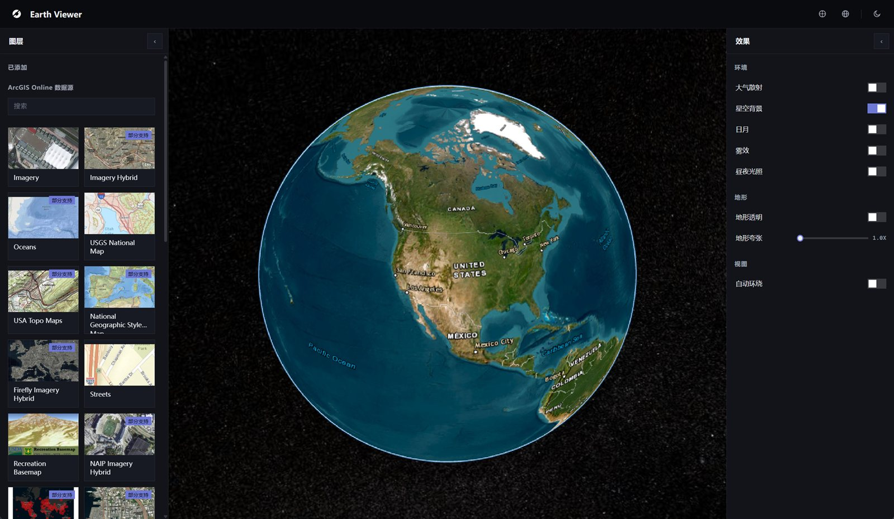

#  Earth Viewer

[](https://github.com/gis2all/earth-viewer/actions/workflows/ci.yml)
[](LICENSE)
[](https://gis2all.github.io/earth-viewer/)
[](https://github.com/gis2all/earth-viewer/actions)
[](https://github.com/gis2all/earth-viewer/actions)
[](https://github.com/gis2all/earth-viewer/actions)

3D 地球图层应用：Cesium 渲染地球，接入 ArcGIS Online 公开图层，搜索、评估、添加、叠加和管理地图图层，并实时调节地球渲染效果。



## 技术栈

| 技术 | 职责 |
| --- | --- |
| React 18 | UI 组件 |
| CesiumJS  | 3D 地球渲染 |
| TypeScript 5.6 | 类型安全 |
| Vite 5 | 开发与构建 |
| zustand | 全局状态与持久化 |
| proj4 / @mapbox/vector-tile / pbf | ArcGIS 数据转换 |
| Vitest / Testing Library | 单元测试 |
| Playwright | E2E 浏览器回归 |
| Node.js（内置 http） | 生产静态托管 + `/sharing` ArcGIS 代理 |
| Docker | 容器化运行 |

## 快速开始

### 一、本机 Node 方式

需要 Node.js 22 与 npm：

```text
npm install
npm run dev
```

启动后访问 http://localhost:5173 。开发态已内置 `/sharing` 代理（vite 中间件转发到 `www.arcgis.com`，绕开浏览器 CORS）。

### 二、Docker 方式

需要 Docker（含 Compose）：

```text
docker compose up --build
```

构建镜像会先执行 `npm ci && npm run build` 生成生产产物，再由内置 Node 服务同时托管静态文件与 `/sharing` ArcGIS 代理。启动后访问 http://localhost:5173 。停止：`docker compose down`；需要改端口时，修改 `docker-compose.yml` 的 `ports` 映射。

## 常用命令

| 命令 | 用途 |
| --- | --- |
| `npm run dev` | 启动开发服务 |
| `npm run build` | 类型检查 + 生产构建 |
| `npm run preview` | 本地预览生产构建产物 |
| `npm run test` | 运行 Vitest 单元测试 |
| `npm run lint` | ESLint 代码检查 |
| `npm run test:e2e` | 运行 Playwright E2E（含真实 ArcGIS 集成，需网络） |
| `node server/proxy.mjs 5173` | 生产静态托管 + ArcGIS 代理（先执行 `npm run build`） |

GitHub Actions 在 `push`（main）与 `pull_request` 时执行：`npm audit --omit=dev`（生产依赖审计）、lint、单元测试、生产构建、Playwright E2E。

## 架构

```text
LayerPanel（画廊）
  -> ArcGIS Online 搜索（/sharing/rest/search）
  -> 预取 webmap JSON -> assessWebmap() 能力评估（过滤不可渲染项）
  -> 点卡片 addLayer 写入 zustand store（localStorage 持久化）
GlobeViewer（Cesium）
  -> 监听 added -> renderableLayersFromWebmap() 得到应渲染层
  -> 投影探测（detectCrs）-> 构建 ImageryProvider / GeoJSON DataSource / KML
  -> 增量叠加到地球（layerMapRef 管理生命周期，取消 / 竞态防护）
```

评估与渲染共用同一份能力判断（`assess.ts`），不在两处各写一套，保证「画廊能加的，球上一定能渲染」。

## 目录结构

```text
src/app/              UI：顶栏、左右面板（AppShell / LayerPanel / EffectsPanel）
src/globe/            Cesium 核心：GlobeViewer、cameraApi、geo(用户定位)、webmap、assess 与各数据源适配
src/state/            zustand 全局状态（theme / collapsed / added / effects / userHome）
src/styles/           全部样式（直角、深浅主题 CSS 变量）
e2e/                  Playwright 冒烟、UI 与真实 ArcGIS 集成测试
functions/            Cloudflare Pages Functions：/sharing/* 代理 + /api/geo 用户定位
server/               通用 Node 生产服务（proxy.mjs）与 Nginx 部署示例
.github/workflows/    CI 门禁
```

## 数据源

- **ArcGIS Online 公开资源**：搜索接口 `www.arcgis.com/sharing/rest/search`；公开瓦片服务匿名访问、不消耗 credits


## 更多文档

- [`CLAUDE.md`](CLAUDE.md)：项目真相、架构、设计决策

## 许可证

[MIT License](LICENSE)